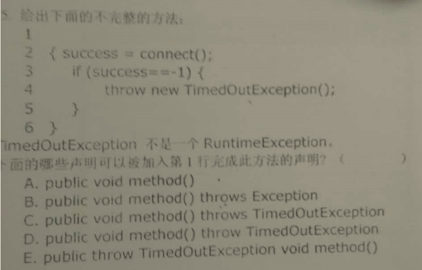
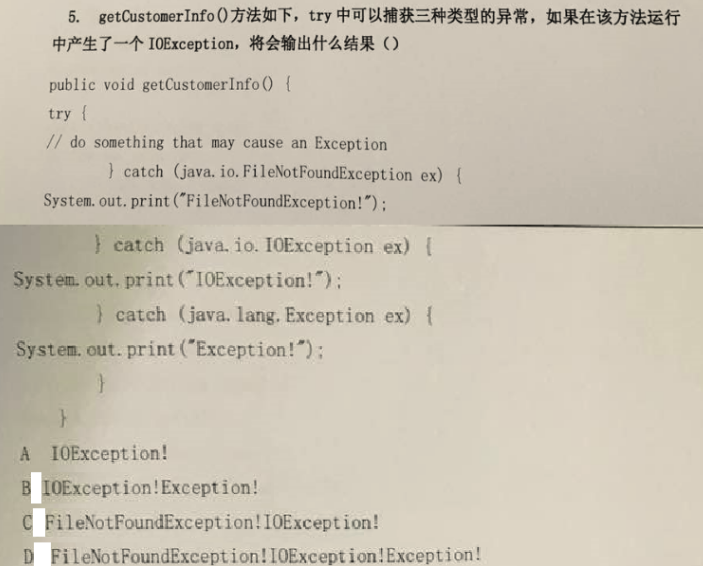

# day12_课后练习

# 代码阅读题

## 第1题

```java
	public static void main(String[] args) {
		int test = test(3,5);
		System.out.println(test);//8
	}

	public static int test(int x, int y){
		int result = x;
		try{
			if(x<0 || y<0){
				return 0;
			}
			result = x + y;
			return result;//(1)先把result的值8放到操作数栈中，（2）然后走finally（3）结束当前方法
		}finally{
			result = x - y;//这个result=-2的值，不会放到操作数栈中，因为没有return
		}
	}
```

```java
/*
 * （1）finally块中的代码是无论try中是否发生异常，也无论catch是否可以捕获异常，
 * 也不管try和catch中是否有return语句，都会执行的部分
 * （2）如果finally中有return语句，那么try...catch...finally结构
 * 一定从finally中的return回去
 * （3）如果finally中没有return语句，那么try...catch...finally结构
 * 才会从try或catch中的return回去，但是finally值中代码不会影响最终的返回值
 */
```


## 第2题

```java
public class Test02 {
	public static void main(String[] args) {
		try{
			return;
		}finally{
			System.out.println("finally");
		}
	}
}
```

```java
/*
 * finally块中的代码是无论try中是否发生异常，也无论catch是否可以捕获异常，
 * 也不管try和catch中是否有return语句，都会执行的部分
 */
```


## 第3题

```java
public class Test03 {
	{
		System.out.println("a");
	}
	static{
		System.out.println("b");
	}
	Test03(){
		System.out.println("c");
	}
	public static String getOut(){
		try{
			return "1";
		}catch(Exception e){
			return "2";
		}finally{
			return "3";
		}
	}
	public static void main(String[] args) {
		System.out.println(getOut());
	}
}
```

```java
/*
 * （1）main()执行之前，需要先完成所在类的初始化
 * （2）类初始化由两部分代码组成：①静态变量的显式赋值代码②静态代码块
 * （3）没有创建对象，不会执行实例初始化相关的代码
 * （4）finally块中的代码是无论try中是否发生异常，也无论catch是否可以捕获异常，
 * 也不管try和catch中是否有return语句，都会执行的部分
 * （5）如果finally中有return语句，那么try...catch...finally结构
 * 一定从finally中的return回去
 */
```


## 第4题

```java
public class Test04 {
	static int i = 0;
	public static void main(String[] args) {
		System.out.println(test());
	}

	public static int test(){
		try{
			return ++i;//(1)先自增（2）把i的值放到操作数栈（3）走finally
		}finally{
			return ++i;//(4)再自增（5）又取i的值放到操作数栈（4）结束方法
		}
	}
}
```

```java
/*
 * （1）finally块中的代码是无论try中是否发生异常，也无论catch是否可以捕获异常，
 * 也不管try和catch中是否有return语句，都会执行的部分
 * （2）如果finally中有return语句，那么try...catch...finally结构
 * 一定从finally中的return回去，但是try和catch中的return语句中返回值的表达式会执行。
 * （3）如果finally中没有return语句，那么try...catch...finally结构
 * 才会从try或catch中的return回去，但是finally值中代码不会影响最终的返回值
 */
```


## 第5题

```java
import java.io.IOException;

public class Test05 {
	public static void main(String[] args) {
		int a = -1;
		try{
			if(a>0){
				throw new RuntimeException("");
			}else if(a<0){
				throw new IOException("");
			}else{
				return ;
			}
		}catch(IOException ioe){
			System.out.println("IOException");
		}catch(Throwable e){
			System.out.println("Throwable");
		}finally{
			System.out.println("finally");
		}
	}
}
```

```kava
/*
 * （1）throw用于手动抛出异常
 * （2）无论是JVM抛出的异常还是throw抛出的异常都需要catch处理
 * （3）catch是多分支结构，从上到下按顺序匹配，只会进入第一个匹配上的catch分支
 * （4）finally块中的代码是无论try中是否发生异常，也无论catch是否可以捕获异常，
 * 也不管try和catch中是否有return语句，都会执行的部分
 */
```


## 第6题

```java
public class Test06 {
	public static int fun(){
		int result = 5;
		try{
			result = result / 0;
			return result;
		}catch(Exception e){
			System.out.println("Exception");
			result = -1;
			return result;//(1)先把-1放到操作数栈（2）走finally（3）结束
		}finally{
			result = 10;
			System.out.println("I am in finally.");
		}
	}
	public static void main(String[] args) {
		int x = fun();
		System.out.println(x);
	}
}

```

```java
/*
 * （1）finally块中的代码是无论try中是否发生异常，也无论catch是否可以捕获异常，
 * 也不管try和catch中是否有return语句，都会执行的部分
 * （2）如果finally中有return语句，那么try...catch...finally结构
 * 一定从finally中的return回去
 * （3）如果finally中没有return语句，那么try...catch...finally结构
 * 才会从try或catch中的return回去，但是finally值中代码不会影响最终的返回值
 */
```


## 第7题

```java
	public static int aMethod(int i)throws Exception{
		try{
			return i / 10;
		}catch(Exception ex){
			throw new Exception("exception in aMethod");
		}finally{
			System.out.println("finally");
		}
	}
	public static void main(String[] args) {
		try {
			aMethod(0);
		} catch (Exception e) {
			System.out.println("exception in main");
		}
	}
```

```java
/*
 * （1）finally块中的代码是无论try中是否发生异常，也无论catch是否可以捕获异常，
 * 也不管try和catch中是否有return语句，都会执行的部分
 * （2）throw用于手动抛出异常
 * （3）throws用于将异常抛给调用者处理
 */
```


# 代码编程题

## 第8题

案例：

​	在一款角色扮演游戏中,每一个人都会有名字和生命值，角色的生命值不能为负数。

​	要求：当一个人物的生命值为负数的时候需要抛出自定的异常

操作步骤描述：

（1）自定义异常类NoLifeValueException继承RuntimeException

①提供空参和有参构造

②在有参构造中，需要调用父类的有参构造，把异常信息传入

（2）定义Person类

①属性：名称(name)和生命值(lifeValue)

②提供空参构造

③提供有参构造：使用setXxx方法给name和lifeValue赋值

④提供setter和getter方法：

​	在setLifeValue(int lifeValue)方法中，首先判断，如果 lifeValue为负数,就抛出NoLifeValueException，异常信息为：生命值不能为负数：xx；

​	然后在给成员lifeValue赋值。

（3）定义测试类Test08

①使用满参构造方法创建Person对象，生命值传入一个负数

由于一旦遇到异常,后面的代码的将不在执行,所以需要注释掉上面的代码

②使用空参构造创建Person对象

调用setLifeValue(int lifeValue)方法,传入一个正数,运行程序

调用setLifeValue(int lifeValue)方法,传入一个负数,运行程序

③分别对①和②处理异常和不处理异常进行运行看效果

```java
package com.atguigu.test08;

public class NoLifeValueException extends RuntimeException{

	public NoLifeValueException() {
		super();
	}

	public NoLifeValueException(String message) {
		super(message);
		
	}
}

```

```java
package com.atguigu.test08;

public class Person {
	private String name;
	private  int lifeValue;
	public Person() {
		super();
	}
	public Person(String name, int lifeValue) {
		super();
		setName(name);
		setLifeValue(lifeValue);
	}
	public String getName() {
		return name;
	}
	public void setName(String name) {
		this.name = name;
	}
	public int getLifeValue() {
		return lifeValue;
	}
	public void setLifeValue(int lifeValue) {
		if(lifeValue<0){
			throw new NoLifeValueException("生命值不能为负数：" + lifeValue);
		}
		this.lifeValue = lifeValue;
	}
	
}

```

```java
package com.atguigu.test08;

public class Test08 {
	public static void main(String[] args) {
		try {
			Person p = new Person("白蛇",-1);
		} catch (Exception e) {
			e.printStackTrace();
		}
		
		try {
			Person p2 = new Person();
			p2.setLifeValue(10);
			p2.setLifeValue(-10);
		} catch (Exception e) {
			e.printStackTrace();
		}
	}
}

```


## 第9题

请编写代码演示OOM错误

```java
package com.atguigu.test09;

public class Test09_01 {

	public static void main(String[] args) {
		int[] arr = new int[Integer.MAX_VALUE];
	}
}

```

```java
package com.atguigu.test09;

import java.util.ArrayList;

/*
设置JVM参数
-verbose:gc
-Xms20M
-Xmx20M
-Xmn10M
-XX:+PrintGCDetails
-XX:SurvivorRatio=8

其中：
Xms:最小堆
Xmx:最大堆
Xmn:新生代的大小
PrintGCDetails：打印GC日志
SurvivorRatio：Eden区和Survivor比例
 */
public class Test09_02 {
	public static void main(String[] args) {
		ArrayList list=new ArrayList();
	    //通过不断的创建对象达到OOM
	    while (true){
	        list.add(new Object());
	    }
	}
}

```


# 选择题

## 第10题



```java
BC
throws的异常类型要>=方法中抛出的异常类型
【修饰符】 返回值类型 方法名(【形参列表】)throws 异常列表{

}
```


## 第11题



```java
catch是多分支结构，从上到下按顺序匹配，只会进入第一个匹配上的catch分支
```


# 简答题

问题：

1. 请描述异常的继承体系
2. 请描述你对错误(Error)的理解
3. 请描述你对异常(Expection的理解)
4. 请描述你对运行时异常(RuntimeException)的理解
5. throw与throws的区别
6. 异常处理方式有几种,分别是什么?详细阐述每种方式对异常是如何处理的
7. 请列举常见异常，并说明产生原因。