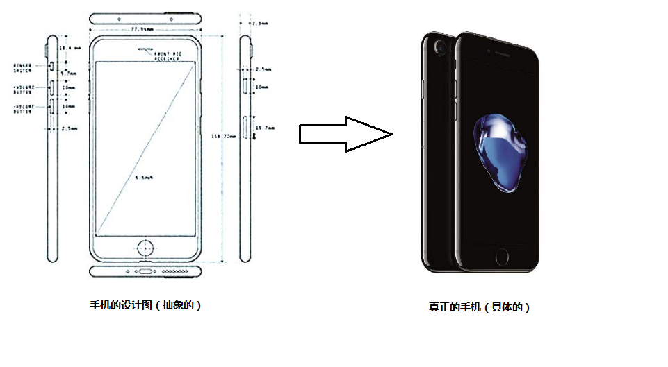
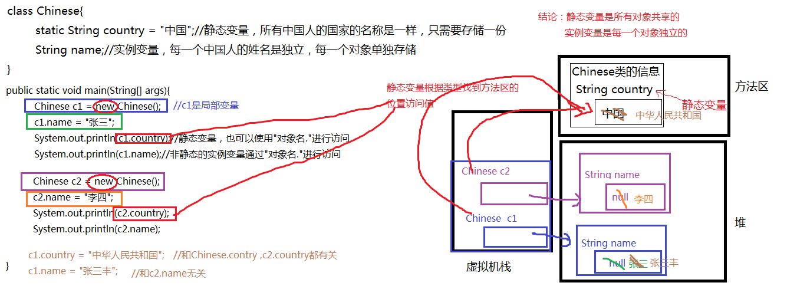
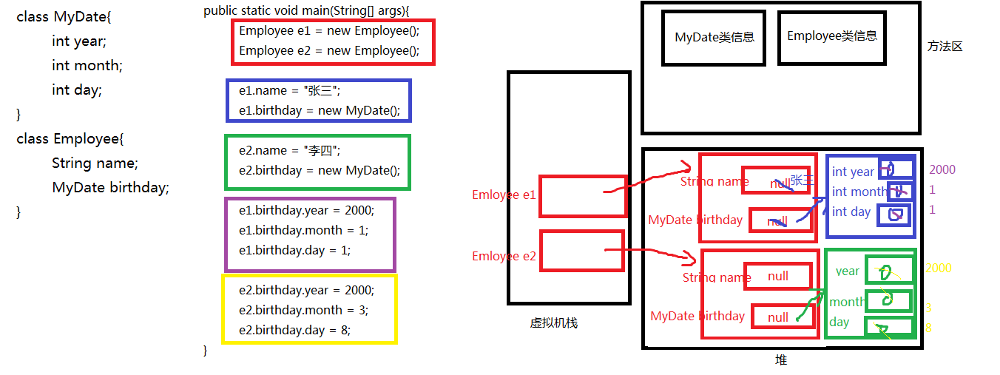
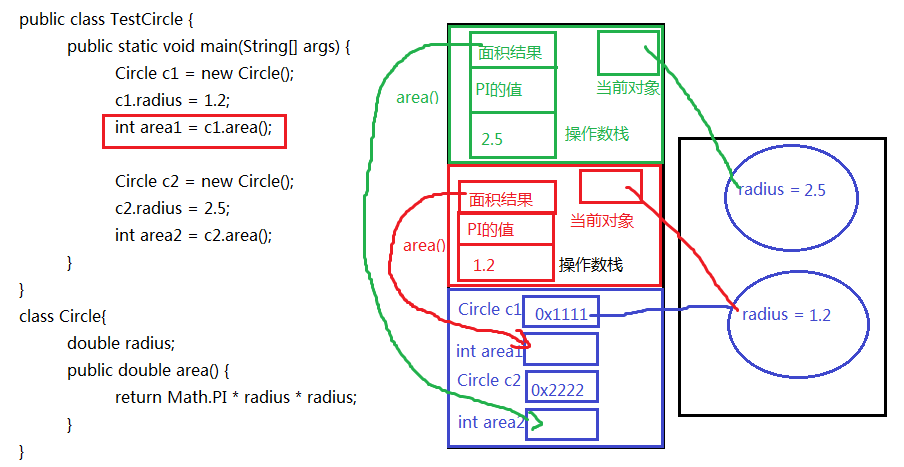

# JavaSE_day06【面向对象基础--上】 

## 今日内容

- 类与对象
- 成员变量
- 成员方法

## 学习目标

- [ ] 初步了解面向对象的思想
- [ ] 能够明确类与对象关系
- [ ] 能够掌握类的定义格式
- [ ] 能够掌握创建对象格式
- [ ] 能够通过类访问类的静态成员变量和静态成员方法
- [ ] 能够通过对象访问对象的普通成员变量和普通成员方法
- [ ] 能够区别静态方法和普通方法
- [ ] 能够区别类变量与实例变量
- [ ] 能够区别成员变量与局部变量
- [ ] 能够理解方法的调用执行机制
- [ ] 能够理解方法的参数传递机制


# 第五章 面向对象基础（上）

## 5.1 面向对象思想概述

### 1、概述

Java语言是一种面向对象的程序设计语言，而面向对象思想（OOP）是一种程序设计思想，我们在面向对象思想的指引下，使用Java语言去设计、开发计算机程序。
这里的**对象**泛指现实中一切事物，每种事物都具备自己的**属性**和**行为**。面向对象思想就是在计算机程序设计过程中，参照现实中事物，将事物的属性特征、行为特征抽象出来，描述成计算机事件的设计思想。
它区别于面向过程思想（POP），强调的是通过调用对象的行为来实现功能，而不是自己一步一步的去操作实现。

### 2、面向对象与面向过程的区别

面向过程：POP: Process-Oriented Programming

​	以函数（方法）为最小单位

​	数据独立于函数之外

​	以过程，步骤为主，考虑怎么做

面向对象：OOP: Object Oriented Programming

​	以类/对象为最小单位，类包括：数据+方法

​	以对象（谁）为主，考虑谁来做，谁能做

面向对象仍然包含面向过程，只不过关注点变了，关注谁来做

程序员的角色：

面向过程：程序员是具体执行者

面向对象：程序员是指挥者

面向对象思想是一种更符合我们思考习惯的思想，它可以将复杂的事情简单化，并将我们从执行者变成了指挥者。

3、面向对象的基本特征

面向对象的语言中，包含了三大基本特征，即封装、继承和多态。

## 5.2 类和对象

环顾周围，你会发现很多对象，比如桌子，椅子，同学，老师等。桌椅属于办公用品，师生都是人类。那么什么是类呢？什么是对象呢？

### 什么是类

* **类**：是一类具有相同特性的事物的抽象描述，是一组相关**属性**和**行为**的集合。可以看成是一类事物的模板，使用事物的属性特征和行为特征来描述该类事物。

现实中，描述一类事物：

* **属性**：就是该事物的状态信息。
* **行为**：就是该事物能够做什么。

举例：小猫。

​	属性：名字、体重、年龄、颜色。
​	行为：走、跑、叫。

### 什么是对象

* **对象**：是一类事物的具体体现。对象是类的一个**实例**（对象并不是找个女朋友），必然具备该类事物的属性和行为。

现实中，一类事物的一个实例：一只小猫 。

举例：一只小猫。

​	属性：tom、5kg、2 years、yellow。
​	行为：溜墙根走、蹦跶的跑、喵喵叫。

### 类与对象的关系

- 类是对一类事物的描述，是**抽象的**。
- 对象是一类事物的实例，是**具体的**。
- **类是对象的模板，对象是类的实体**。

 

## 5.3 类的定义和对象的创建

### 事物与类的对比

现实世界的一类事物：

​	**属性**：事物的状态信息。
​	**行为**：事物能够做什么。

 Java中用class描述事物也是如此：

​	**成员变量**：对应事物的**属性**
​	**成员方法**：对应事物的**行为**

### 类的定义格式

```java
public class ClassName {
  //成员变量
  //成员方法 
}
```

* **定义类**：就是定义类的成员，包括**成员变量**和**成员方法**。
* **成员变量**：和以前定义变量几乎是一样的。只不过位置发生了改变。**在类中，方法外**。
* **成员方法**：和以前写的main方法格式类似。只不过功能和形式更丰富了。在类中，方法外。

类的定义格式举例：

```java
public class Person {
  	//成员变量
  	String name；//姓名
    int age；//年龄
    boolean isMarried;
    
    public void walk(){
        System.out.println("人走路...");
    }
    public String display(){
        return "名字是：" + name + "，年龄是：" + age + "，Married：" + isMarried;
    }
}
```

### 对象的创建

创建对象：

```java
new 类名()//也称为匿名对象

//给创建的对象命名
//或者说，把创建的对象用一个引用数据类型的变量保存起来
类名 对象名 = new 类名();
```

那么，对象名中存储的是什么呢？答：对象地址

```java
class Student{
    
}
public class TestStudent{
    //Java程序的入口
    public static void main(String[] args){
        System.out.println(new Student());//Student@7852e922

        Student stu = new Student();
        System.out.println(stu);//Student@4e25154f
        
        int[] arr = new int[5];
		System.out.println(arr);//[I@70dea4e
    }
}
//Student和TestStudent没有位置要求，谁在上面谁在下面都可以
//但是如果TestStudent类的main中使用了Student类，那么要求编译时，这个Student已经写好了，不写是不行的
//如果两个类都在一个.java源文件中，只能有一个类是public的
```

发现学生对象和数组对象类似，直接打印对象名和数组名都是显示“类型@对象的hashCode值"，所以说类、数组都是引用数据类型，引用数据类型的变量中存储的是对象的地址，或者说指向堆中对象的首地址。

那么像“Student@4e25154f”是对象的地址吗？不是，因为Java是对程序员隐藏内存地址的，不暴露内存地址信息，所以打印对象时不直接显示内存地址，而是JVM提取了对象描述信息给你现在，默认提取的是对象的运行时类型@代表对象唯一编码的hashCode值。


## 5.4 成员变量

### 1、成员变量的分类

实例变量：没有static修饰，也叫对象属性，属于某个对象的，通过对象来使用

类变量：有static修饰，也叫类变量，属于整个类的，不是属于某个实例

### 2、如何声明成员变量？

```java
【修饰符】 class 类名{
    【修饰符】 数据类型  属性名;    //属性有默认值
    【修饰符】 数据类型  属性名 = 值; //属性有初始值
}
```

> 说明：属性的类型可以是Java的任意类型，包括基本数据类型、引用数据类型（类、接口、数组等）

例如：声明一个中国人的类

```java
class Chinese{
	static String country;
	String name;
    char gender = '男';//显式赋值
}
```

### 3、如何在类外面访问成员变量？

#### （1）类变量

```java
类名.静态成员变量  //推荐

对象名.静态成员变量 //不推荐
```

#### （2）实例变量

```java
对象名.普通成员变量  //只能使用这种方式
```

例如：

```java
public class TestChinese {
	public static void main(String[] args) {
		//类名.静态成员变量
		System.out.println(Chinese.country);
		//错误，普通成员变量必须通过对象.进行访问
//		System.out.println(Chinese.name);
		
		Chinese c1 = new Chinese();
		//对象名.普通成员变量
		System.out.println(c1.name);
		//静态的成员变量也可以通过对象.进行访问
		//对象名.普通成员变量
		System.out.println(c1.country);
        System.out.println(c1.gender);
	}
}
class Chinese{
	static String country;
	String name;
    char gender = '男';
}
```

### 4、成员变量的特点

#### （1）成员变量有默认值

| 基本类型 | 整数（byte，short，int，long） | 0        |
| -------- | ------------------------------ | -------- |
|          | 浮点数（float，double）        | 0.0      |
|          | 字符（char）                   | '\u0000' |
|          | 布尔（boolean）                | false    |
|          | 数据类型                       | 默认值   |
| 引用类型 | 数组，类，接口                 | null     |

#### （2）类变量的值是所有对象共享的，而实例变量的值是每个对象独立的

```java
public class TestChinese {
	public static void main(String[] args) {
		Chinese c1 = new Chinese();
		Chinese c2 = new Chinese();
		
		c1.name = "张三";
		c2.name = "李四";
        c2.gender = '女';
		
//		c1.country = "中国";
		Chinese.country = "中国";//推荐
		
		System.out.println("c1.country = " + c1.country + ",c1.name = " + c1.name + ",c1.gender = " + c1.gender);
		System.out.println("c2.country = " + c2.country + ",c2.name = " + c2.name + ",c2.gender = " + c2.gender);
	}	
}
class Chinese{
	static String country;
	String name;
    char gender = '男';
}
```

### 5、成员变量的内存图

​	内存是计算机中重要的部件之一，它是与CPU进行沟通的桥梁。其作用是用于暂时存放CPU中的运算数据，以及与硬盘等外部存储器交换的数据。只要计算机在运行中，CPU就会把需要运算的数据调到内存中进行运算，当运算完成后CPU再将结果传送出来。我们编写的程序是存放在硬盘中的，在硬盘中的程序是不会运行的，必须放进内存中才能运行，运行完毕后会清空内存。Java虚拟机要运行程序，必须要对内存进行空间的分配和管理，每一片区域都有特定的处理数据方式和内存管理方式。


| 区域名称   | 作用                                                         |
| ---------- | ------------------------------------------------------------ |
| 程序计数器 | 程序计数器是CPU中的寄存器，它包含每一个线程下一条要执行的指令的地址 |
| 本地方法栈 | 当程序中调用了native的本地方法时，本地方法执行期间的内存区域 |
| 方法区     | 存储已被虚拟机加载的类信息、常量、静态变量、即时编译器编译后的代码等数据。 |
| 堆内存     | 存储对象（包括数组对象），new来创建的，都存储在堆内存。      |
| 虚拟机栈   | 用于存储正在执行的每个Java方法的局部变量表等。局部变量表存放了编译期可知长度的各种基本数据类型、对象引用，方法执行完，自动释放。 |

```java
class Test08FieldSave{
	public static void main(String[] args){
		Chinese c1 = new Chinese();
		c1.name = "张三";
		System.out.println(c1.country);//静态变量，也可以使用"对象名."进行访问
		System.out.println(c1.name);//普通成员变量通过"对象名."进行访问
		
		
		Chinese c2 = new Chinese();
		c2.name = "李四";
		System.out.println(c2.country);
		System.out.println(c2.name);
		
		System.out.println("--------------------------------------");
		//其中一个对象将静态变量的值修改了，其他对象都会改变
		//因为静态变量只存一份
		c1.country = "中华人民共和国";
		System.out.println(c1.country);
		System.out.println(c2.country);
		System.out.println(Chinese.country);
		
		
		//其中一个对象将普通成员变量修改了，其他对象不受影响
		c1.name = "张三丰";
		System.out.println(c1.name);
		System.out.println(c2.name);
	}
	
}

class Chinese{
	static String country = "中国";//静态成员变量，所有中国人的国家的名称是一样，只需要存储一份
	String name;//普通成员变量，每一个中国人的姓名是独立，每一个对象单独存储
}
```



```java
class MyDate{
	int year;
	int month;
	int day;
}
class Employee{
	String name;
	MyDate birthday;
}
class Test09FieldExer3{
	public static void main(String[] args){
		//创建两个员工对象
		Employee e1 = new Employee();
		Employee e2 = new Employee();
		
		//为两个员工对象的成员变量赋值
		e1.name = "张三";
		e1.birthday = new MyDate();
		
		e2.name = "李四";
		e2.birthday = new MyDate();
		
		e1.birthday.year = 2000;
		e1.birthday.month = 1;
		e1.birthday.day = 1;
		
		e2.birthday.year = 2000;
		e2.birthday.month = 3;
		e2.birthday.day = 8;
		
		System.out.println("第一个员工，姓名：" + e1.name +"，生日：" + e1.birthday.year + "年" + e1.birthday.month + "月" + e1.birthday.day + "日");
		System.out.println("第二个员工，姓名：" + e2.name +"，生日：" + e2.birthday.year + "年" + e2.birthday.month + "月" + e2.birthday.day + "日");
	}
}
```




### 6、成员变量练习题

（1）声明一个圆的图形类，有属性：半径
	在测试类的main中，创建圆的2个对象，为半径属性赋值，并显示两个圆的半径值和面积值
	提示：圆周率为Math.PI

（2）声明一个银行账户类，有属性：利率、账号、余额

​	在测试类的main中，创建账户类的两个对象，其中所有账户的利率是相同的，都是0.035，而账号和余额是不同的，并打印显示

（3）声明一个MyDate类型，有属性：年，月，日

​		  声明另一个Employee类型，有属性：姓名（String类型），生日（MyDate类型）

在测试类中的main中，创建两个员工对象，并为他们的姓名和生日赋值，并显示


## 5.5 成员方法

成员变量是用来存储对象的数据信息的，那么如何表示对象的行为功能呢？就要通过方法来实现

### 5.5.1 方法的概念

方法也叫函数，是一个独立功能的定义，是一个类中最基本的功能单元。

把一个功能封装为方法的目的是，可以实现代码重用，从而简少代码量。

### 5.5.2  方法的原则

方法的使用原则：

（1）必须先声明后使用

>  类，变量，方法等都要先声明后使用

（2）不调用不执行，调用一次执行一次。

### 5.5.3 成员方法的分类

成员方法分为两类：

* 实例方法：没有static修饰的方法，必须通过实例对象来调用。
* 静态方法：有static修饰的方法，也叫类方法，可以由类名来调用。

### 5.5.4 如何声明方法

1、方法声明的位置必须在类中方法外

2、语法格式

```java
【修饰符】 返回值类型 方法名(【参数列表：参数类型1 参数名1,参数类型2 参数名, ...... 】){
        方法体；
        【return 返回值;】
}
```

- 修饰符： 修饰符后面一一介绍，例如：public，static等都是修饰符
- 返回值类型： 表示方法运行的结果的数据类型，方法执行后将结果返回到调用者
  - 基本数据类型
  - 引用数据类型
  - 无返回值类型：void
- 方法名：给方法起一个名字，见名知意，能准确代表该方法功能的名字
- 参数列表：方法内部需要用到其他方法中的数据，需要通过参数传递的形式将数据传递过来，可以是基本数据类型、引用数据类型、也可以没有参数，什么都不写
- 方法体：特定功能代码
- return：结束方法，并将方法的结果返回去，
  - 如果返回值类型不是void，方法体中必须保证一定有return 返回值;语句，并且要求该返回值结果的类型与声明的返回值类型一致或兼容。
  - 如果返回值类型为void时，return 后面不用跟返回值，甚至也可以没有return语句。
  - return语句后面就不能再写其他代码了，否则会报错：Unreachable code

声明位置示例：

```java
类{
    方法1(){
        
    }
    方法2(){
        
    }
}
```

错误示例：

```java
类{
    方法1(){
        方法2(){  //位置错误
        
   		}
    }
}
```

#### 示例一：

声明一个圆的图形类：

​	属性（成员变量）：半径，

​	成员方法：求面积的方法，返回圆对象信息的方法

​	在测试类的main中，创建圆的2个对象，为半径属性赋值，调用两个方法进行测试
​	提示：圆周率为Math.PI

```java
class Circle{
	double radius;
	double area() {
		return Math.PI * radius * radius;
	}
}
```

> Circle不同的对象，半径值不同，那么面积也不同，所以这里area()是非静态的

#### 示例二：

声明一个计算工具类CountTools：

​	方法1：求两个整数的最大值

```java
class CountTools{
	static int max(int a, int b) {
        return a > b ? a : b;
	}
}
```

> CountTools只是一个工具类，求两个整数最大值的功能，和CountTools对象无关，所以这里max方法声明为静态的更好，当然也可以声明为非静态的，就是调用的时候需要创建CountTools对象而已。

### 5.5.5 如何在其他类中调用方法

#### （1）实例方法

```java
对象名.普通方法(【实参列表】)  //必须通过对象来访问
```

示例代码：

```java
public class TestCircle {
	public static void main(String[] args) {
		Circle c1 = new Circle();
		c1.radius = 1.2;
		System.out.println("c1的面积：" + c1.area());
		//普通方法只能通过"对象."进行访问
//		System.out.println("c1的面积：" + Circle.area());
        
		Circle c2 = new Circle();
		c2.radius = 2.5;
		System.out.println("c2的面积：" + c2.area());
	}
}
class Circle{
	double radius;
	public double area() {
		return Math.PI * radius * radius;
	}
}
```

#### （2）类方法

```java
类名.类方法(【实参列表】)  //推荐

对象名.类方法(【实参列表】) //不推荐
```

示例：

```java
public class TestCount {
	public static void main(String[] args) {
		System.out.println(CountTools.max(4, 1));
		
		//静态方法也可以通过“对象.”访问，就是麻烦点
		CountTools c = new CountTools();
		System.out.println(c.max(2, 5));
	}
}
class CountTools{
	static int max(int a, int b) {
		return a > b ? a : b;
	}
}
```

#### （3）总结

* 形参：在定义方法时方法名后面括号中声明的变量称为形式参数（简称形参）即形参出现在方法定义时。
* 实参：调用方法时方法名后面括号中的使用的值/变量/表达式称为实际参数（简称实参）即实参出现在方法调用时。

总结：

（1）调用时，需要传“实参”，实参的个数、类型、顺序顺序要与形参列表一一对应

​		如果方法没有形参，就不需要也不能传实参。

（2）调用时，如果方法有返回值，可以接受或处理返回值结果，当然也可以不接收，那么此时返回值就丢失了。

​		如果方法的返回值类型是void，不需要也不能接收和处理返回值结果。

### 5.5.6 在本类中访问本类的成员变量和成员方法

直接用，不需要加“对象名."和"类名."

唯一例外：静态方法中不能直接访问本类的非静态的成员变量和成员方法

```java
class Circle{
	double radius;
	
	//写一个方法，可以返回“圆对象”的详细信息
	String getDetailInfo(){
		return "半径：" + radius + "，面积：" + area() +"，周长：" + perimeter();
	}
	
	//写一个方法，可以返回“圆对象”的面积
	double area(){
		return Math.PI*radius*radius;
	}
	
	//写一个方法，可以返回“圆对象”的周长
	double perimeter(){
		return 2*Math.PI*radius;
	}

}
```

```java
class Test{
		
	static void test(){
		System.out.println("");
	}
	void method(){
		 test();
	}
    
    public static void main(String[] args){
        method();//错误
        test();//正确
    }
}
```

### 5.5.7 方法的声明与调用练习

1、声明数学工具类MathTools

（1）静态方法1：可以比较两个整数是否相同
（2）静态方法2：可以判断某个数是否是素数
（3）静态方法3：可以返回某个整数所有的约数（约数：从1到这个数之间所有能把它整除的数）
在Test测试类的main中调用测试

2、声明数组工具类ArraysTools

（1）静态方法1：可以实现给任意整型数组实现从小到大排序
（2）静态方法2：可以遍历任意整型数组，返回结果效果：[元素1，元素2，元素3。。。]

3、声明矩形类

（1）包含属性：长、宽

（2）包含3个方法：

​	求面积、

​	求周长、

​	返回矩形对象的信息：长：xx，宽：xx，面积：xx，周长：xx

4、声明一个圆类，有半径radius成员变量

​     声明一个图形工具类GraphicTools，包含一个静态方法可以返回两个圆中面积大的那一个圆的方法

​	在测试类中测试

### 5.5.8 方法调用内存分析

方法不调用不执行，调用一次执行一次，每次调用会在栈中有一个入栈动作，即给当前方法开辟一块独立的内存区域，用于存储当前方法的局部变量的值，当方法执行结束后，会释放该内存，称为出栈，如果方法有返回值，就会把结果返回调用处，如果没有返回值，就直接结束，回到调用处继续执行下一条指令。

栈结构：先进后出，后进先出。

示例一：

```java
public class TestCount {
	public static void main(String[] args) {
        int a = 4;
        int b = 2;
		int m = CountTools.max(a, b));
	}
}
class CountTools{
	static int max(int a, int b) {
		return a > b ? a : b;
	}
}
```


示例二：

```java
public class TestCircle {
	public static void main(String[] args) {
		Circle c1 = new Circle();
		c1.radius = 1.2;
		int area1 = c1.area();
		
		Circle c2 = new Circle();
		c2.radius = 2.5;
		int area2 = c2.area();
	}
}
class Circle{
	double radius;
	public double area() {
		return Math.PI * radius * radius;
	}
}
```



示例三：

```java
public class Test {
	public static void main(String[] args) {
		int[] arr = {2,4,1,5,3};
		
		ArrayUtil.sort(arr);
		
		for (int i = 0; i < arr.length; i++) {
			System.out.println(arr[i]);
		}
	}
}
class ArrayUtil{
	public static void sort(int[] arr){
		for (int i = 1; i < arr.length; i++) {
			for (int j = 0; j < arr.length - i; j++) {
				if(arr[j] > arr[j+1]){
					int temp = arr[j];
					arr[j] = arr[j+1];
					arr[j+1] = temp;
				}
			}
		}
	}
}
```


### 5.5.9 方法的参数传递机制

* 方法的参数传递机制：实参给形参赋值
  * 方法的形参是基本数据类型时，形参值的改变不会影响实参；
  * 方法的形参是引用数据类型时，形参地址值的改变不会影响实参，但是形参地址值里面的数据的改变会影响实参，例如，修改数组元素的值，或修改对象的属性值。
    * 注意：String、Integer等特殊类型容易错

示例代码1：

```java
class Test{
    public static void swap(int a, int b){
        int temp = a;
        a = b;
        b = temp;
	}

	public static void main（String[] args){
        int x = 1;
        int y = 2;
        swap(x,y);//调用完之后，x与y的值不变
    }
}

```

示例代码2：

```java
class Test{
    public static void change(MyData my){
        my.num *= 2;
    }
    
    public static void main(String[] args){
        MyData m = new MyData();
        m.num = 1;
        
        change(m);//调用完之后，m对象的num属性值就变为2
    }
}

class MyData{
    int num;
}
```

示例代码3：

```java
public class Test {
	public static void main(String[] args) {
		int[] arr = {2,4,1,5,3};
		
		ArrayUtil.sort(arr);
		
		for (int i = 0; i < arr.length; i++) {
			System.out.println(arr[i]);
		}
	}
}
class ArrayUtil{
	public static void sort(int[] arr){
		for (int i = 1; i < arr.length; i++) {
			for (int j = 0; j < arr.length - i; j++) {
				if(arr[j] > arr[j+1]){
					int temp = arr[j];
					arr[j] = arr[j+1];
					arr[j+1] = temp;
				}
			}
		}
	}
}
```

陷阱1：

```java
/*
陷阱1：在方法中，形参 = 新new对象，那么就和实参无关了
*/
class Test{
    public static void change(MyData my){
        my = new MyData();//形参指向了新对象
        my.num *= 2;
    }
    
    public static void main(String[] args){
        MyData m = new MyData();
        m.num = 1;
        
        change(m);//调用完之后，m对象的num属性值仍然为1
    }
}

class MyData{
    int num;
}
```

陷阱2：见字符串和包装类部分

```java
public class Test {
	public static void main(String[] args) {
		StringUtil util = new StringUtil();
		String str = "尚硅谷";
		util.change(str);
		System.out.println(str);
	}
}
class StringUtil{
	public void change(String str){
		str += "你好";//String对象不可变，一旦修改就会产生新对象
	}
}
```

### 5.5.10 成员变量与局部变量的区别

#### 1、变量的分类

* 成员变量
  * 静态变量
  * 实例变量

* 局部变量

#### 2、区别

1、声明位置和方式
（1）静态变量：在类中方法外，并且有static修饰
（2）实例变量：在类中方法外，没有static修饰
（3）局部变量：在方法体{}中或方法的形参列表、代码块中

2、在内存中存储的位置不同
（1）静态变量：方法区
（2）实例变量：堆
（3）局部变量：栈

3、生命周期
（1）静态变量：和类的生命周期一样，因为它的值是该类所有对象共享的，早于对象的创建而存在。
（2）实例变量：和对象的生命周期一样，随着对象的创建而存在，随着对象被GC回收而消亡，
			而且每一个对象的实例变量是独立的。
（3）局部变量：和方法调用的生命周期一样，每一次方法被调用而在存在，随着方法执行的结束而消亡，
			而且每一次方法调用都是独立。

4、作用域
（1）静态变量和实例变量：不谈作用域
在本类中，唯一的限制，静态方法或静态代码块中不能使用非静态的，其他都可以直接使用。
在其他类中，能不能使用看修饰符（public,protected,private等）
（2）局部变量：有作用域
出了作用域就不能使用

5、修饰符（后面来讲）
（1）静态变量：很多
public,protected,private,final,volatile等，一定有的是static
（2）实例变量
public,protected,private,final,volatile,transient等
（3）局部变量
final

public,protected,private：权限修饰符
final：是否是常量，即值是否可以修改
volatile：和多线程有关
transient：是否序列化，和IO有关	

6、默认值
（1）静态变量：有默认值
（2）实例变量：有默认值
（3）局部变量：没有，必须初始化
		其中的形参比较特殊，靠实参给它初始化。

## 5.6 可变参数

在**JDK1.5**之后，如果我们定义一个方法时，此时某个形参的类型可以确定，但是形参的个数不确定，那么我们可以使用可变参数。

格式：

```
【修饰符】 返回值类型 方法名(【非可变参数部分的形参列表,】参数类型... 形参名){  }
```

要求：

（1）一个方法最多只能有一个可变参数

（2）如果一个方法包含可变参数，那么可变参数必须是形参列表的最后一个

```
【修饰符】 返回值类型 方法名(【非可变参数部分的形参列表,】参数类型[] 形参名){  }
```

只是后面这种定义，在调用时必须传递数组，而前者更灵活，既可以传递数组，又可以直接传递数组的元素，这样更灵活了。

## 5.7 方法重载

- **方法重载**：指在同一个类中，允许存在一个以上的同名方法，只要它们的参数列表不同即可，与修饰符和返回值类型无关。
- 参数列表：数据类型个数不同，数据类型不同，数据类型顺序不同。
- 重载方法调用：JVM通过方法的参数列表，调用不同的方法。

#### 示例一：比较两个数据是否相等

比较两个数据是否相等。参数类型分别为两个`byte`类型，两个`short`类型，两个`int`类型，两个`long`类型，并在`main`方法中进行测试。 

```java
public class Method_Demo6 {
    public static void main(String[] args) {
        //定义不同数据类型的变量
        byte a = 10;
        byte b = 20;
        short c = 10;
        short d = 20;
        int e = 10;
        int f = 10;
        long g = 10;
        long h = 20;
        // 调用
        System.out.println(compare(a, b));
        System.out.println(compare(c, d));
        System.out.println(compare(e, f));
        System.out.println(compare(g, h));
    }
    // 两个byte类型的
    public static boolean compare(byte a, byte b) {
        System.out.println("byte");
        return a == b;
    }

    // 两个short类型的
    public static boolean compare(short a, short b) {
        System.out.println("short");
        return a == b;
    }

    // 两个int类型的
    public static boolean compare(int a, int b) {
        System.out.println("int");
        return a == b;
    }

    // 两个long类型的
    public static boolean compare(long a, long b) {
        System.out.println("long");
        return a == b;
    }
}
```

#### 示例二：求各种最大值

用重载实现：
定义方法求两个整数的最大值
定义方法求三个整数的最大值
定义方法求两个小数的最大值

```java
//求两个整数的最大值
public int max(int a,int b){
    return a>b?a:b;
}
	
//求三个整数的最大值
public int max(int a, int b, int c){
    return max(max(a,b),c);
}
	
//求两个小数的最大值
public double max(double a, double b){
    return a>b?a:b;
}
```

## 5.8  对象数组

数组是用来存储一组数据的容器，一组基本数据类型的数据可以用数组装，那么一组对象也可以使用数组来装。

即数组的元素可以是基本数据类型，也可以是引用数据类型。当元素是引用数据类型是，我们称为对象数组。

> 注意：对象数组，首先要创建数组对象本身，即确定数组的长度，然后再创建每一个元素对象，如果不创建，数组的元素的默认值就是null，所以很容易出现空指针异常NullPointerException。

### 示例一：

（1）定义圆Circle类，包含radius半径属性，getArea()求面积方法，getPerimeter()求周长方法，String getInfo()返回圆对象的详细信息的方法

（2）在测试类中创建长度为5的Circle[]数组，用来装5个圆对象，并给5个圆对象的半径赋值为[1,10)的随机值

```java
class Test16_ObjectArray{
	public static void main(String[] args){
		//要在数组中存储5个圆对象
		//声明一个可以用来存储圆对象的数组
		Circle[] arr = new Circle[5];
		//for(int i=0; i<arr.length; i++){
		//	System.out.println(arr[i]);
		//}
		//System.out.println(arr[0].radius);//NullPointerException
		
		//给元素赋值
		//元素的类型是：Circle，应该给它一个Circle的对象
		//arr[0] = 1.2;//错误的
		//arr[0]相当于它是一个Circle类型的变量，也是对象名，必须赋值为对象
		/*
		arr[0] =  new Circle();
		arr[0].radius = 1.2;
		System.out.println(arr[0].radius);
		*/
		
		//创建5个对象，半径随机赋值为[1,10)的随机值
		//Math.random()==>[0,1)
		//Math.random()*9==>[0,9)
		//Math.random()*9+1==>[1,10)
		for(int i=0; i<arr.length; i++){
			arr[i] = new Circle();//有对象才有半径
			arr[i].radius = Math.random()*9+1;
		}
		
		
		//遍历显示圆对象的信息
		for(int i=0; i<arr.length; i++){
			//arr[i]是一个Circle的对象，就可以调用Circle类中的属性和方法
			System.out.println(arr[i].getInfo());
		}
	}
}
class Circle{
	double radius;
	public double getArea(){
		return 3.14 * radius * radius;
	}
	public double getPerimeter(){
		return 3.14 * 2 * radius;
	}
	public String getInfo(){
		return "半径：" + radius +"，面积：" + getArea() + "，周长：" + getPerimeter();
	}
}
```


### 练习1

（1）定义学生类Student

​	声明姓名和成绩实例变量，

​	getInfo()方法：用于返回学生对象的信息

（2）测试类ObjectArrayTest的main中创建一个可以装3个学生对象的数组，并且按照学生成绩排序，显示学生信息

```java
public class ObjectArrayTest {
	public static void main(String[] args) {
		Student[] arr = new Student[3];
		arr[0] = new Student();
		arr[0].name = "张三";
		arr[0].score = 89;
		
		arr[1] = new Student();
		arr[1].name = "李四";
		arr[1].score = 84;
		
		arr[2] = new Student();
		arr[2].name = "王五";
		arr[2].score = 85;
		
		for (int i = 1; i < arr.length; i++) {
			for (int j = 0; j < arr.length-1; j++) {
				if(arr[j].score > arr[j+1].score){
					Student temp = arr[j];
					arr[j] = arr[j+1];
					arr[j+1] = temp;
				}
			}
		}
		
		for (int i = 0; i < arr.length; i++) {
			System.out.println(arr[i].getInfo());
		}
	}
}
class Student{
	String name;
	int score;
	public String getInfo(){
		return "姓名：" + name + ",成绩：" + score;
	}
}
```

```java
class Test18_ObjectArrayExer2_2{
	public static void main(String[] args){
		//创建一个可以装3个学生对象的数组
		Student[] arr = new Student[3];//只是申明这个数组，可以用来装3个学生，此时里面没有学生对象
		
		//从键盘输入
		java.util.Scanner input = new java.util.Scanner(System.in);
		for(int i=0;i<arr.length; i++){
			System.out.println("请输入第" + (i+1) + "个学生信息：");
			arr[i] = new Student();
			
			System.out.print("姓名：");
			arr[i].name = input.next();
			
			System.out.print("成绩：");
			arr[i].score = input.nextInt();
		}
		
		//先显示一下目前的顺序
		for(int i=0; i<arr.length; i++){
			System.out.println(arr[i].getInfo());
		}
		
		System.out.println("------------------------------------------");
		//冒泡排序
		for(int i=1; i<arr.length; i++){
			for(int j=0; j<arr.length-i; j++){
				//arr[j] > arr[j+1]//错误的
				if(arr[j].score > arr[j+1].score){
					//交换两个元素，这里是两个学生对象，所以temp也得是Student类型
					Student temp = arr[j];
					arr[j] = arr[j+1];
					arr[j+1] = temp;
				}
			}
		}
		//再显示一下目前的顺序
		for(int i=0; i<arr.length; i++){
			System.out.println(arr[i].getInfo());
		}
	}
}
class Student{
	String name;
	int score;//使用int或double都可以
	
	public String getInfo(){
		return "姓名：" + name +"，成绩：" + score;
	}
}
```


