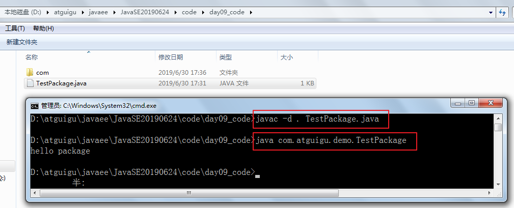

# JavaSE_day07【面向对象基础--中】

## 今日内容

* 封装
* 权限修饰符
* 包
* 构造器
* 代码块

## 教学目标

* [ ] 理解封装的概念
* [ ] 掌握权限修饰符的使用
* [ ] 掌握属性的封装
* [ ] 理解包的作用
* [ ] 掌握包的声明与导入
* [ ] 掌握构造器的声明与使用
* [ ] 掌握this关键字的使用
* [ ] 会声明标准的JavaBean

# 第六章 面向对象基础--中

## 6.1 封装

### 6.1.1 封装概述

#### 1、为什么需要封装？

* 我要用洗衣机，只需要按一下开关和洗涤模式就可以了。有必要了解洗衣机内部的结构吗？有必要碰电动机吗？
* 我们使用的电脑，内部有CPU、硬盘、键盘、鼠标等等，每一个部件通过某种连接方式一起工作，但是各个部件之间又是独立的
* 现实生活中，每一个个体与个体之间是有边界的，每一个团体与团体之间是有边界的，而同一个个体、团体内部的信息是互通的，只是对外有所隐瞒。

面向对象编程语言是对客观世界的模拟，客观世界里每一个事物的内部信息都是隐藏在对象内部的，外界无法直接操作和修改，只能通过指定的方式进行访问和修改。封装可以被认为是一个保护屏障，防止该类的代码和数据被其他类随意访问。适当的封装可以让代码更容易理解与维护，也加强了代码的安全性。

随着我们系统越来越复杂，类会越来越多，那么类之间的访问边界必须把握好，面向对象的开发原则要遵循“高内聚、低耦合”，而“高内聚，低耦合”的体现之一：

* 高内聚：类的内部数据操作细节自己完成，不允许外部干涉；
* 低耦合：仅对外暴露少量的方法用于使用

隐藏对象内部的复杂性，只对外公开简单的接口。便于外界调用，从而提高系统的可扩展性、可维护性。通俗的讲，把该隐藏的隐藏起来，该暴露的暴露出来。这就是封装性的设计思想。

#### 2、如何实现封装呢？

通俗的讲，封装就是把该隐藏的隐藏起来，该暴露的暴露出来。那么暴露的程度如何控制呢？就是依赖访问控制修饰符，也称为权限修饰符来控制。

访问控制修饰符来控制相应的可见边界，边界有如下：

（1）类

（2）包

（3）子类

（4）模块：Java9之后引入

权限修饰符：public,protected,缺省,private

| 修饰符    | 本类 | 本包 | 其他包子类 | 其他包非子类 | 其他模块                 |
| --------- | ---- | ---- | ---------- | ------------ | ------------------------ |
| private   | √    | ×    | ×          | ×            | ×                        |
| 缺省      | √    | √    | ×          | ×            | ×                        |
| protected | √    | √    | √          | ×            | ×                        |
| public    | √    | √    | √          | √            | 默认不可以，可以建立依赖 |

外部类：public和缺省

成员变量：public,protected,缺省,private

成员方法：public,protected,缺省,private

构造器：public,protected,缺省,private


### 6.1.2 成员变量/属性私有化问题

**<span style="color:red">成员变量（field）私有化</span>之后，提供标准的<span style="color:red">get/set</span>方法，我们把这种成员变量也称为<span style="color:red">属性（property）</span>。**或者可以说只要能通过get/set操作的就是事物的属性，哪怕它没有对应的成员变量。

#### 1、成员变量封装的目的

* 隐藏类的实现细节
* 让使用者只能通过事先预定的方法来访问数据，从而可以在该方法里面加入控制逻辑，限制对成员变量的不合理访问。还可以进行数据检查，从而有利于保证对象信息的完整性。
* 便于修改，提高代码的可维护性。主要说的是隐藏的部分，在内部修改了，如果其对外可以的访问方式不变的话，外部根本感觉不到它的修改。例如：Java8->Java9，String从char[]转为byte[]内部实现，而对外的方法不变，我们使用者根本感觉不到它内部的修改。

#### 2、实现步骤

1. 使用 `private` 修饰成员变量

```java
private 数据类型 变量名 ；
```

代码如下：

```java
public class Chinese {
    private static String country;
    private String name;
  	private int age;
    private boolean marry;
}
```

2. 提供 `getXxx`方法 / `setXxx` 方法，可以访问成员变量，代码如下：

```java
public class Chinese {
  	private static String country;
    private String name;
  	private int age;
    private boolean marry;
    
    public static void setCountry(String c){
        country = c;
    }
    
    public static String getCountry(){
        return country;
    }

	public void setName(String n) {
		name = n;
    }

    public String getName() {
        return name;
	}

    public void setAge(int a) {
        age = a;
    }

    public int getAge() {
        return age;
    }
    
    public void setMarry(boolean m){
        marry = m;
    }
    
    public boolean isMarry(){
        return marry;
    }
}
```

#### 3、如何解决局部变量与成员变量同名问题

当局部变量与类变量（静态成员变量）同名时，在类变量前面加“类名."；

当局部变量与实例变量（非静态成员变量）同名时，在实例变量前面加“this.”

```java
public class Chinese {
  	private static String country;
    private String name;
  	private int age;
    
    public static void setCountry(String country){
        Chinese.country = country;
    }
    
    public static String getCountry(){
        return country;
    }

	public void setName(String name) {
		this.name = name;
    }

    public String getName() {
        return name;
	}

    public void setAge(int age) {
        this.age = age;
    }

    public int getAge() {
        return age;
    }
}
```

#### 4、 练习

（1）定义矩形类Rectangle，

​	声明静态变量sides，初始化为4，表示矩形边长的总数量；

​	声明实例变量长和宽

​	全部私有化，并提供相应的get/set方法

（2）在测试类中创建Rectangle对象，并调用相应的方法测试

（2）测试类ObjectArrayTest的main中创建一个可以装3个学生对象的数组，并且按照学生成绩排序，显示学生信息


### 6.1.3 包（Package）
#### 1、包的作用

（1）可以避免类重名：有了包之后，类的全名称就变为：包.类名

（2）分类组织管理众多的类

例如：

* java.lang----包含一些Java语言的核心类，如String、Math、Integer、 System和Thread等，提供常用功能
* java.net----包含执行与网络相关的操作的类和接口。
* java.io ----包含能提供多种输入/输出功能的类。
* java.util----包含一些实用工具类，如集合框架类、日期时间、数组工具类Arrays，文本扫描仪Scanner，随机值产生工具Random。
* java.text----包含了一些java格式化相关的类
* java.sql和javax.sql----包含了java进行JDBC数据库编程的相关类/接口
* java.awt和java.swing----包含了构成抽象窗口工具集（abstract window toolkits）的多个类，这些类被用来构建和管理应用程序的图形用户界面(GUI)。

（3）可以控制某些类型或成员的可见范围

如果某个类型或者成员的权限修饰缺省的话，那么就仅限于本包使用

#### 2、声明包的语法格式

```java
package 包名;
```

> 注意：
>
> (1)必须在源文件的代码首行
>
> (2)一个源文件只能有一个声明包的语句

包的命名规范和习惯：
（1）所有单词都小写，每一个单词之间使用.分割
（2）习惯用公司的域名倒置

例如：com.atguigu.xxx;

> 建议大家取包名时不要使用“java.xx"包

#### 3、如何在命令行编译和运行声明包的Java文件（了解）

编译格式：

```
javac -d class文件存放路径 源文件路径名.java
```

例如：

```java
package com.atguigu.demo;

public class TestPackage {
	public static void main(String[] args) {
		System.out.println("hello package");
	}
}
```
编译：
```java
javac -d . TestPackage.java
```

> 其中 . 表示在当前目录生成包目录

运行：

```java
java com.atguigu.demo.TestPackage
```

> 定位到com目录的外面才能正确找到这个类
>
> 使用类的全名称才能正确运行这个类



#### 4、如何跨包使用类

前提：被使用的类或成员的权限修饰符是>缺省的，即可见的

（1）使用类型的全名称

例如：java.util.Scanner input = new java.util.Scanner(System.in);

（2）使用import 语句之后，代码中使用简名称

import语句告诉编译器到哪里去寻找类。

import语句的语法格式：

```java
import 包.类名;
import 包.*;
import static 包.类名.静态成员;
```

> 注意：
>
> 使用java.lang包下的类，不需要import语句，就直接可以使用简名称
>
> import语句必须在package下面，class的上面
>
> 当使用两个不同包的同名类时，例如：java.util.Date和java.sql.Date。一个使用全名称，一个使用简名称


示例代码：

```java
package com.atguigu.bean;

public class Student {
	// 成员变量
	private String name;
	private int age;

	// 构造方法
	public Student() {
	}

	public Student(String name, int age) {
		this.name = name;
		this.age = age;
	}

	// 成员方法
	public void setName(String name) {
		this.name = name;
	}

	public String getName() {
		return name;
	}

	public void setAge(int age) {
		this.age = age;
	}

	public int getAge() {
		return age;
	}
}
```

```java
package com.atguigu.test;

import java.util.Scanner;
import java.util.Date;
import com.atguigu.bean.Student;

public class Test{
    public static void main(String[] args){
        Scanner input = new Scanner(System.in);
        Student stu = new Student();
        String str = "hello";
        
        Date now = new Date();
        java.sql.Date d = new java.sql.Date(346724566);        
    }
}
```


## 6.2 构造器（Constructor)

我们发现我们new完对象时，所有成员变量都是默认值，如果我们需要赋别的值，需要挨个为它们再赋值，太麻烦了。我们能不能在new对象时，直接为当前对象的某个或所有成员变量直接赋值呢。

可以，Java给我们提供了构造器。

#### 1、构造器的作用

在创建对象的时候为实例变量赋初始值。

> **注意：构造器只为实例变量初始化，不为静态类变量初始化**

#### 2、构造器的语法格式

构造器又称为构造方法，那是因为它长的很像方法。但是和方法还有有所区别的。

```java
【修饰符】 构造器名(){
    // 实例初始化代码
}
【修饰符】 构造器名(参数列表){
	// 实例初始化代码
}
```

代码如下：

```java
public class Student {
	private String name;
	private int age;
	// 无参构造
  	public Student() {} 
 	// 有参构造
  	public Student(String name,int age) {
		this.name = name;
    	this.age = age; 
	}
  	
	public String getName() {
		return name;
	}
	public void setName(String name) {
		this.name = name;
	}
	public int getAge() {
		return age;
	}
	public void setAge(int age) {
		this.age = age;
	}
}
```

注意事项：

1. 构造器名必须与它所在的类名必须相同。
2. 它没有返回值，所以不需要返回值类型，甚至不需要void
3. 如果你不提供构造器，系统会给出无参数构造器，并且该构造器的修饰符默认与类的修饰符相同
4. 如果你提供了构造器，系统将不再提供无参数构造器，除非你自己定义。
5. 构造器是可以重载的，既可以定义参数，也可以不定义参数。
6. 构造器的修饰符只能是权限修饰符，不能被其他任何修饰

#### 3、练习

（1）声明一个员工类，

* 包含属性：编号、姓名、薪资、性别，要求属性私有化，提供get/set，
* 提供无参构造器和有参构造器
* 提供getInfo()

（2）在测试类的main中分别用无参构造和有参构造创建员工类对象，调用getInfo

```java
public class TestEmployee {
	public static void main(String[] args){
		//分别用无参构造和有参构造创建对象，调用getInfo
		Employee e1 = new Employee();
		System.out.println(e1.getInfo());
		
		Employee e2 = new Employee("1001","张三",110000,'男');
		System.out.println(e2.getInfo());
		
		e2.setSalary(120000);
		System.out.println(e2.getInfo());
		
		System.out.println("e1薪资：" + e1.getSalary());
	}
}
class Employee{
	private String id;
	private String name;
	private double salary;
	private char gender;
	
	//提供无参构造器和有参构造器
	public Employee(){
		
	}
	public Employee(String id, String name){
		this.id = id;
		this.name = name;
	}
	public Employee(String id, String name, double salary, char gender){
		this.id = id;
		this.name = name;
		this.salary = salary;
		this.gender = gender;
	}
	
	public String getId() {
		return id;
	}
	public void setId(String id) {
		this.id = id;
	}
	public String getName() {
		return name;
	}
	public void setName(String name) {
		this.name = name;
	}
	public double getSalary() {
		return salary;
	}
	public void setSalary(double salary) {
		this.salary = salary;
	}
	public char getGender() {
		return gender;
	}
	public void setGender(char gender) {
		this.gender = gender;
	}
	
	//提供getInfo()
	public String getInfo(){
		return "编号：" + id + "，姓名：" + name + "，薪资：" + salary + "，性别：" +gender;
	}
}
```

## 6.3 标准JavaBean

`JavaBean` 是 Java语言编写类的一种标准规范。符合`JavaBean` 的类，要求：

（1）类必须是具体的和公共的，

（2）并且具有无参数的构造方法，

（3）成员变量私有化，并提供用来操作成员变量的`set` 和`get` 方法。

```java
public class ClassName{
  //成员变量
    
  //构造方法
  	//无参构造方法【必须】
  	//有参构造方法【建议】
  	
  //getXxx()
  //setXxx()
  //其他成员方法
}
```

 编写符合`JavaBean` 规范的类，以学生类为例，标准代码如下：

```java
public class Student {
	// 成员变量
	private String name;
	private int age;

	// 构造方法
	public Student() {
	}

	public Student(String name, int age) {
		this.name = name;
		this.age = age;
	}

	// get/set成员方法
	public void setName(String name) {
		this.name = name;
	}

	public String getName() {
		return name;
	}

	public void setAge(int age) {
		this.age = age;
	}

	public int getAge() {
		return age;
	}
    
    //其他成员方法列表
    public String getInfo(){
        return "姓名：" + name + "，年龄：" + age;
    }
}
```

测试类，代码如下：

```java
public class TestStudent {
	public static void main(String[] args) {
		// 无参构造使用
		Student s = new Student();
		s.setName("柳岩");
		s.setAge(18);
		System.out.println(s.getName() + "---" + s.getAge());
        System.out.println(s.getInfo());

		// 带参构造使用
		Student s2 = new Student("赵丽颖", 18);
		System.out.println(s2.getName() + "---" + s2.getAge());
        System.out.println(s2.getInfo());
	}
}
```


