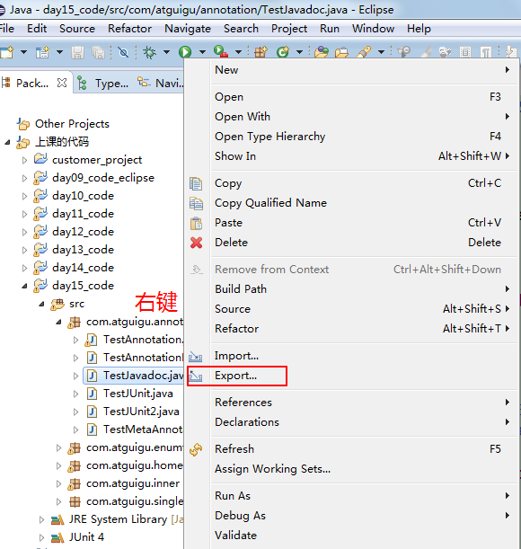
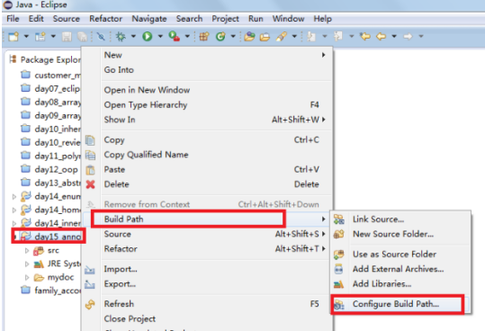
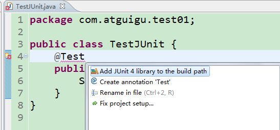
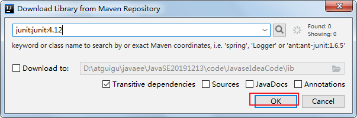

# JavaSE_day11【内部类、注解】

## 今日内容

* 内部类
* 注解

## 学习目标

* [ ] 说出内部类的几种形式
* [ ] 能够声明静态内部类和非静态成员内部类
* [ ] 能够看懂和声明匿名内部类
* [ ] 能够使用系统预定义的三个基本注解
* [ ] 能够编写文档注释
* [ ] 能够使用JUnit框架的@Test注解
* [ ] 能够读懂元注解

# 第七章 面向对象基础--下（续）

## 7.4 内部类

### 7.4.1 概述

1、什么是内部类？

将一个类A定义在另一个类B里面，里面的那个类A就称为**内部类**，B则称为**外部类**。


2、为什么要声明内部类呢？

当一个事物的内部，还有一个部分需要一个完整的结构进行描述，而这个内部的完整的结构又只为外部事物提供服务，不在其他地方单独使用，那么整个内部的完整结构最好使用内部类。

而且内部类因为在外部类的里面，因此可以直接访问外部类的私有成员。


3、内部类都有哪些形式？

根据内部类声明的位置（如同变量的分类），我们可以分为：

（1）成员内部类：

* 静态成员内部类
* 非静态成员内部类

（2）局部内部类

* 有名字的局部内部类
* 匿名的内部类

### 7.4.2 静态内部类

语法格式：

```java
【修饰符】 class 外部类{
    【其他修饰符】 static class 内部类{
    }
}
```

静态内部类的特点：

* 和其他类一样，它只是定义在外部类中的另一个完整的类结构
  * 可以继承自己的想要继承的父类，实现自己想要实现的父接口们，和外部类的父类和父接口无关
  * 可以在静态内部类中声明属性、方法、构造器等结构，包括静态成员
  * 可以使用abstract修饰，因此它也可以被其他类继承
  * 可以使用final修饰，表示不能被继承
  * 编译后有自己的独立的字节码文件，只不过在内部类名前面冠以外部类名和$符号。
* 和外部类不同的是，它可以允许四种权限修饰符：public，protected，缺省，private
  * 外部类只允许public或缺省的
* **只**可以在静态内部类中使用外部类的**静态成员**
  * 在静态内部类中不能使用外部类的非静态成员哦
* 在外部类的外面不需要通过外部类的对象就可以创建静态内部类的对象
* 如果在内部类中有变量与外部类的静态成员变量同名，可以使用“外部类名."进行区别

示例代码：

```java
public class TestInner{
    public static void main(String[] args){
    	Outer.Inner in= new Outer.Inner();
    	in.inMethod();
    	
    	Outer.Inner.inTest();
        
        Outer.Inner.inFun(3);
    }
}

class Outer{
	private static int a = 1;
	private int b = 2;
	protected static class Inner{
		static int d = 4;//可以
		void inMethod(){
			System.out.println("out.a = " + a);
//			System.out.println("out.b = " + b);//错误的
		}
		static void inTest(){
			System.out.println("out.a = " + a);
		}
        static void inFun(int a){
			System.out.println("out.a = " + Outer.a);
            System.out.println("local.a = " + a);
		}
	}
}
```

> 其实严格的讲（在James Gosling等人编著的《The Java Language Specification》）静态内部类不是内部类，而是类似于C++的嵌套类的概念，外部类仅仅是静态内部类的一种命名空间的限定名形式而已。所以接口中的内部类通常都不叫内部类，因为接口中的内部成员都是隐式是静态的（即public static)。例如：Map.Entry。

### 7.4.3 非静态成员内部类

语法格式：

```java
【修饰符】 class 外部类{
    【修饰符】 class 内部类{
    }
}
```

非静态内部类的特点：

* 和其他类一样，它只是定义在外部类中的另一个完整的类结构
  * 可以继承自己的想要继承的父类，实现自己想要实现的父接口们，和外部类的父类和父接口无关
  * 可以在非静态内部类中声明属性、方法、构造器等结构，但是**不允许声明静态成员**，但是可以**继承**父类的静态成员，而且**可以声明静态常量**。
  * 可以使用abstract修饰，因此它也可以被其他类继承
  * 可以使用final修饰，表示不能被继承
  * 编译后有自己的独立的字节码文件，只不过在内部类名前面冠以外部类名和$符号。
* 和外部类不同的是，它可以允许四种权限修饰符：public，protected，缺省，private
  * 外部类只允许public或缺省的
* 还可以在非静态内部类中使用外部类的**所有成员**，哪怕是私有的

* 在外部类的静态成员中不可以使用非静态内部类哦
  * 就如同静态方法中不能访问本类的非静态成员变量和非静态方法一样
* 在外部类的外面必须通过外部类的对象才能创建非静态内部类的对象
  * 因此在非静态内部类的方法中有两个this对象，一个是外部类的this对象，一个是内部类的this对象

示例代码：

```java
public class TestInner{
    public static void main(String[] args){
    	Outer out = new Outer();
    	Outer.Inner in= out.new Inner();
    	in.inMethod();
    	
    	Outer.Inner inner = out.getInner();
    	inner.inMethod();
    }
}
class Father{
	protected static int c = 3;
}
class Outer{
	private static int a = 1;
	private int b = 2;
	protected class Inner extends Father{
//		static int d = 4;//错误
		int b = 5;
		void inMethod(){
			System.out.println("out.a = " + a);
			System.out.println("out.b = " + Outer.this.b);
			System.out.println("in.b = " + b);
			System.out.println("father.c = " + c);
		}
	}
	
	public static void outMethod(){
//		Inner in = new Inner();//错误的
	}
	public Inner getInner(){
		return new Inner();
	}
}
```

#### 练习1：语法练习题

声明一个身体Body类，包含一个私有的boolean类型的属性live，初始化为true，表示活着。属性私有化，提供get/set方法。

声明一个身体Body的内部类Heart，包含void beat()方法，当live为true时，打印“心脏在跳动”，否则打印“心脏停止跳动"。因为Heart只为外部类Body服务，而又具有自己的方法，属性等，而且这里应该是有Body实体存在的情况下才能有Heart实体，所以这里把Heart声明为非静态内部类。

声明一个测试类，在测试类的主方法中，创建身体和心脏的对象，调用心脏对象的beat()方法，然后调用身体对象的setLive()方法，设置为false后，再调用心脏对象的beat()方法查看结果。

```java
public class Person {
    private  boolean live = true;
    class Heart {
        public void beat() {
            // 直接访问外部类成员
            if (live) {
                System.out.println("心脏在跳动");
            } else {
                System.out.println("心脏不跳了");
            }
        }
    }

    public boolean isLive() {
        return live;
    }

    public void setLive(boolean live) {
        this.live = live;
    }

}
```

```java
public class InnerDemo {
    public static void main(String[] args) {
        // 创建外部类对象 
        Person p  = new Person();
        // 创建内部类对象
        Heart heart = p.new Heart();

        // 调用内部类方法
        heart.beat();
        // 调用外部类方法
        p.setLive(false);
        // 调用内部类方法
        heart.beat();
    }
}
输出结果:
心脏在跳动
心脏不跳了
```

或

```java
public class Beatable{//可跳动的
    public abstract void beat();
}
```

```java
public class Person {
    private  boolean live = true;
    private  Heart heart = new Heart();
    private class Heart implements Beatable{
        public void jump() {
            // 直接访问外部类成员
            if (live) {
                System.out.println("心脏在跳动");
            } else {
                System.out.println("心脏不跳了");
            }
        }
    }

    public boolean isLive() {
        return live;
    }

    public void setLive(boolean live) {
        this.live = live;
    }

	public Beatable getHeart(){
		return heart;
	}
}
```

```java
public class InnerDemo {
    public static void main(String[] args) {
        // 创建外部类对象 
        Person p  = new Person();
        // 获取内部类对象
        Beatable heart = p.getHeart();

        // 调用内部类方法
        heart.beat();
        // 调用外部类方法
        p.setLive(false);
        // 调用内部类方法
        heart.beat();
    }
}
输出结果:
心脏在跳动
心脏不跳了
```


#### 练习2：简单面试题

判断如下代码的运行结果：

```java
public class Test{
	public Test(){
		Inner s1 = new Inner();
		s1.a = 10;
		Inner s2 = new Inner();
		s2.a = 20;
		Test.Inner s3 = new Test.Inner();
		System.out.println(s3.a);
	}
	class Inner{
		public int a = 5;
	}
	public static void main(String[] args) {
		Test t = new Test();
		Inner r = t.new Inner();
		System.out.println(r.a);
	}
}
```

#### 练习3：高难面试题

代码填空题：

```java
public class TestInner{
    public static void main(String[] args){
    	Outer.Inner in = new Sub();
    	in.method();//输出 hello inner
    }
}

class Outer {
	abstract class Inner{
		abstract void method();
	}
}
class Sub ________（1）__________{
	
	
	
	______（2）多行代码_______________
	
}
```

参考答案：

```java
public class TestInner{
    public static void main(String[] args){
    	Outer.Inner in = new Sub();
    	in.method();//输出 hello inner
    }
}

class Outer {
	abstract class Inner{
		abstract void method();
	}
}
class Sub extends Outer.Inner{
	static Outer out = new Outer();
	Sub(){
		out.super();
	}

	@Override
	void method() {
		System.out.println("hello inner");
	}
	
}
```

### 7.4.4 局部内部类

语法格式：

```java
【修饰符】 class 外部类{
    【修饰符】 返回值类型  方法名(【形参列表】){
            【final/abstract】 class 内部类{
    	}
    }    
}
```

局部内部类的特点：

* 和外部类一样，它只是定义在外部类的某个方法中的另一个完整的类结构
  * 可以继承自己的想要继承的父类，实现自己想要实现的父接口们，和外部类的父类和父接口无关
  * 可以在局部内部类中声明属性、方法、构造器等结构，**但不包括静态成员，除非是从父类继承的或静态常量**
  * 可以使用abstract修饰，因此它也可以被同一个方法的在它后面的其他内部类继承
  * 可以使用final修饰，表示不能被继承
  * 编译后有自己的独立的字节码文件，只不过在内部类名前面冠以外部类名、$符号、编号。
    * 这里有编号是因为同一个外部类中，不同的方法中存在相同名称的局部内部类
* 和成员内部类不同的是，它前面不能有权限修饰符等
* 局部内部类如同局部变量一样，有作用域
* 局部内部类中是否能访问外部类的静态还是非静态的成员，取决于所在的方法
* 局部内部类中还可以使用所在方法的局部常量，即用final声明的局部变量
  * JDK1.8之后，如果某个局部变量在局部内部类中被使用了，自动加final

示例代码：

```java
class Outer{
	private static int a = 1;
	private int b = 2;
	
	public static void outMethod(){
		final int c = 3;
		class Inner{
			public void inMethod(){
				System.out.println("out.a = " + a);
//				System.out.println("out.b = " + b);//错误的，因为outMethod是静态的
				System.out.println("out.local.c = " + c);
			}
		}
		
		Inner in = new Inner();
		in.inMethod();
	}
	
	public void outTest(){
		final int c = 3;
		class Inner{
			public void inMethod(){
				System.out.println("out.a = " + a);
				System.out.println("out.b = " + b);//可以，因为outTest是飞静态的
				System.out.println("method.c = " + c);
			}
		}
		
		Inner in = new Inner();
		in.inMethod();
	}
	
}
```

#### 思考

为什么在局部内部类中使用外部类方法的局部变量要加final呢？

```java
public class TestInner{
	public static void main(String[] args) {
		A obj = Outer.method();
		//因为如果c不是final的，那么method方法执行完，method的栈空间就释放了，那么c也就消失了
		obj.a();//这里打印c就没有中可取了，所以把c声明为常量，存储在方法区中
	}
}

interface A{
	void a();
}
class Outer{
	public static A method(){
		final int c = 3;
		class Sub implements A{
			@Override
			public void a() {
				System.out.println("method.c = " + c);
			}
		}
		return new Sub();
	}
}
```

### 7.4.5  匿名内部类


#### 1、引入

当我们在开发过程中，需要用到一个抽象类的子类的对象或一个接口的实现类的对象，而且只创建一个对象，而且逻辑代码也不复杂。那么我们原先怎么做的呢？

（1）编写类，继承这个父类或实现这个接口

（2）重写父类或父接口的方法

（3）创建这个子类或实现类的对象

例如：

```java
public interface Runnable{
    public abstract void run();
}
```

```java
//声明接口实现类
public class MyRunnable implements Runnable{
    public void run(){
        while(true){
            System.out.println("大家注意安全");
            try
            	Thread.sleep(1000);
            }catch(Exception e){                
            }
        }
    }
}
```

```java
public class Test{
    public static void main(String[] args){
        //如果MyRunnable类只是在这里使用一次，并且只创建它的一个对象
        //分开两个.java源文件，反而不好维护
        Runnable target = new MyRunnable();
        Thread t = new Thread("安全提示线程",target);
        t.start();
    }
}
```

这里，因为考虑到这个子类或实现类是一次性的，那么我们“费尽心机”的给它取名字，就显得多余。那么我们完全可以使用匿名内部类的方式来实现，避免给类命名的问题。

可以修改为如下形式：

```java
public class Test{
    public static void main(String[] args){
        //MyRunnable类只是在这里使用一次，并且只创建它的一个对象，那么这些写代码更紧凑，更好维护
        Runnable target = new Runnable(){
            public void run(){
                while(true){
                    System.out.println("大家注意安全");
                    try
                        Thread.sleep(1000);
                    }catch(Exception e){                
                    }
                }
            }
        };
        Thread t = new Thread("安全提示线程",target);
        t.start();
    }
}
```

#### 2、语法格式

```java
new 父类(【实参列表】){
    重写方法...
}
//()中是否需要【实参列表】，看你想要让这个匿名内部类调用父类的哪个构造器，如果调用父类的无参构造，那么()中就不用写参数，如果调用父类的有参构造，那么()中需要传入实参
```

```java
new 父接口(){
    重写方法...
}
//()中没有参数，因为此时匿名内部类的父类是Object类，它只有一个无参构造
```

> 匿名内部类是没有名字的类，因此在声明类的同时就创建好了唯一的对象。
>

注意：

匿名内部类是一种特殊的局部内部类，只不过没有名称而已。所有局部内部类的限制都适用于匿名内部类。例如：

* 在匿名内部类中是否可以使用外部类的非静态成员变量，看所在方法是否静态
* 在匿名内部类中如果需要访问当前方法的局部变量，该局部变量需要加final

思考：这个对象能做什么呢？


答：（1）调用某个方法（2）赋值给父类/父接口的变量，通过多态引用使用这个对象（3）作为某个方法调用的实参

#### 3、使用方式一：匿名内部类的对象直接调用方法

```java
interface A{
	void a();
}
public class Test{
    public static void main(String[] args){
    	new A(){
			@Override
			public void a() {
				System.out.println("aaaa");
			}
    	}.a();
    }
}
```

```java
class B{
	public void b(){
		System.out.println("bbbb");
	}
}
public class Test{
    public static void main(String[] args){
    	new B(){
    		public void b(){
    			System.out.println("ccccc");
    		}
    	}.b();
    	
    }
}
```

#### 4、使用方式二：通过父类或父接口的变量多态引用匿名内部类的对象

```java
interface A{
	void a();
}
public class Test{
    public static void main(String[] args){
    	A obj = new A(){
			@Override
			public void a() {
				System.out.println("aaaa");
			}
    	};
    	obj.a();
    }
}
```

```java
class B{
	public void b(){
		System.out.println("bbbb");
	}
}
public class Test{
    public static void main(String[] args){
    	B obj = new B(){
    		public void b(){
    			System.out.println("ccccc");
    		}
    	};
    	obj.b();
    }
}
```

#### 5、使用方式三：匿名内部类的对象作为实参

```java
interface A{
	void method();
}
public class Test{
    public static void test(A a){
    	a.method();
    }
    
    public static void main(String[] args){
    	test(new A(){

			@Override
			public void method() {
				System.out.println("aaaa");
			}
    		
    	});
    }   
}
```

#### 6、练习

##### 练习1

声明一个Employee员工类，包含编号、姓名、薪资，

声明一个测试类，在main中，创建Employee[]数组，长度为5，显示原来顺序结果

调用java.util.Arrays数组工具类的排序方法public static void sort(Object[] a, Comparator c)对数组的元素进行排序，用匿名内部类的对象给c形参传入按照薪资比较大小的定制比较器对象。并显示排序后结果

调用java.util.Arrays数组工具类的排序方法public static void sort(Object[] a, Comparator c)对数组的元素进行排序，用匿名内部类的对象给c形参传入按照编号比较大小的定制比较器对象。并显示排序后结果

员工类示例代码：

```java
class Employee{
	private int id;
	private String name;
	private double salary;
	public Employee(int id, String name, double salary) {
		super();
		this.id = id;
		this.name = name;
		this.salary = salary;
	}
	public Employee() {
		super();
	}
	public int getId() {
		return id;
	}
	public void setId(int id) {
		this.id = id;
	}
	public String getName() {
		return name;
	}
	public void setName(String name) {
		this.name = name;
	}
	public double getSalary() {
		return salary;
	}
	public void setSalary(double salary) {
		this.salary = salary;
	}
	@Override
	public String toString() {
		return "Employee [id=" + id + ", name=" + name + ", salary=" + salary + "]";
	}
}
```

测试类：

```java
public class TestInner {
	public static void main(String[] args) {
		Employee[] arr = new Employee[5];
		arr[0] = new Employee(1,"张三",13000);
		arr[1] = new Employee(3,"王五",14000);
		arr[2] = new Employee(2,"李四",13000);
		arr[3] = new Employee(4,"赵六",7000);
		arr[4] = new Employee(5,"钱七",9000);
		
		//原顺序
		System.out.println("员工列表：");
		for (int i = 0; i < arr.length; i++) {
			System.out.println(arr[i]);
		}
		
		Arrays.sort(arr, new Comparator() {
			@Override
			public int compare(Object o1, Object o2) {
				Employee e1 = (Employee) o1;
				Employee e2 = (Employee) o2;
				return Double.compare(e1.getSalary(), e2.getSalary());
			}
		});
		
		System.out.println("按照薪资排序后员工列表：");
		for (int i = 0; i < arr.length; i++) {
			System.out.println(arr[i]);
		}
		
		Arrays.sort(arr, new Comparator() {
			@Override
			public int compare(Object o1, Object o2) {
				Employee e1 = (Employee) o1;
				Employee e2 = (Employee) o2;
				return e1.getId() - e2.getId();
			}
		});
				
		System.out.println("按照编号排序后员工列表：");
		for (int i = 0; i < arr.length; i++) {
			System.out.println(arr[i]);
		}
	}
}
```

##### 练习2

（1）声明一个抽象类Father，包含抽象方法：public abstract void method();
（2）用匿名内部类继承Father，并重写抽象方法，打印“hello baby"
并调用子类对象的method方法

```java
public abstract class Father{
	public abstract void method();
}
```

```java
public class TestExer1 {
	public static void main(String[] args) {
		new Father(){

			@Override
			public void method() {
				System.out.println("hello 孩子");
			}
			
		}.method();
	}
}
```

##### 练习3

（1）声明一个员工类Triangle三角形，有属性：a,b,c表示三条边
（2）在测试类中创建Triangle数组
（3）分别调用Arrays.sort(数组，Comparator)，用匿名内部类实现按照编号周长排列
（4）分别调用Arrays.sort(数组，Comparator)，用匿名内部类实现按照薪资面积排列

```java
public class Triangle {
	private double a;
	private double b;
	private double c;
	public Triangle(double a, double b, double c) {
		super();
		this.a = a;
		this.b = b;
		this.c = c;
	}
	public Triangle() {
		super();
	}
	public double getA() {
		return a;
	}
	public void setA(double a) {
		this.a = a;
	}
	public double getB() {
		return b;
	}
	public void setB(double b) {
		this.b = b;
	}
	public double getC() {
		return c;
	}
	public void setC(double c) {
		this.c = c;
	}
	@Override
	public String toString() {
		return "Triangle [a=" + a + ", b=" + b + ", c=" + c + "]";
	}
	public double getPerimeter(){
		return a+b+c;
	}
	public double getArea(){
		double p = getPerimeter()/2;
		return Math.sqrt(p*(p-a)*(p-b)*(p-c));
	}
}
```

```java
public class TestExer2 {
	public static void main(String[] args) {
		Triangle[] arr = new Triangle[3];
		arr[0]  = new Triangle(6, 1, 6);
		arr[1]  = new Triangle(3, 4, 5);
		arr[2]  = new Triangle(6, 6, 6);
		
		System.out.println("原来的顺序：");
		for (int i = 0; i < arr.length; i++) {
			System.out.println(arr[i]);
		}
		System.out.println("--------------------");
		System.out.println("按照周长排序：");
		Arrays.sort(arr, new Comparator() {

			@Override
			public int compare(Object o1, Object o2) {
				Triangle t1 = (Triangle) o1;
				Triangle t2 = (Triangle) o2;
				return Double.compare(t1.getPerimeter(), t2.getPerimeter());
			}
		});
		for (int i = 0; i < arr.length; i++) {
			System.out.println(arr[i]);
		}
		System.out.println("--------------------");
		System.out.println("按照面积排序：");
		Arrays.sort(arr, new Comparator() {

			@Override
			public int compare(Object o1, Object o2) {
				Triangle t1 = (Triangle) o1;
				Triangle t2 = (Triangle) o2;
				return Double.compare(t1.getArea(), t2.getArea());
			}
		});
		for (int i = 0; i < arr.length; i++) {
			System.out.println(arr[i]);
		}
	}
}
```

##### 练习4

1、声明一个接口：Predicate接口，包含public abstract boolean test(Object obj);抽象方法
2、声明一个员工类：Employee,有属性：编号、姓名、年龄、薪资
3、声明一个员工管理类：EmployeeService，
（1）包含Employee[] arr，并在EmployeeService构造器中，创建数组，并初始化数组，例如：
arr = new Employee[5];
		arr[0] = new Employee(4, "李四", 24, 24000);
		arr[1] = new Employee(3, "张三", 23, 13000);
		arr[2] = new Employee(5, "王五", 25, 15000);
		arr[3] = new Employee(1, "赵六", 27, 17000);
		arr[4] = new Employee(2, "钱七", 16, 6000);

（2）包含public Employee[] get(Predicate p){
		Employee[] result = new Employee[arr.length];
		int total = 0;
		for(int i=0; i<arr.length; i++){
			if(p.test(arr[i]){
				result[total++] = arr[i];
			}
		}
		return Arrays.copyOf(result,total);
	}		
这个方法的作用，就是用于在arr数组中筛选满足条件的元素
4、在测试类中，创建EmployeeService对象，调用get(Predicate p)方法，通过匿名内部类的对象给形参p赋值，
分别获取：
（1）所有员工对象
（2）所有年龄超过25的员工
（3）所有薪资高于15000的员工
（4）所有编号是偶数的员工
（5）名字是“张三”的员工
（6）年龄超过25，薪资高于15000的员工

```java
public interface Predicate {
	public abstract boolean test(Object obj);
}
```

```java
public class Employee{
	private int id;
	private String name;
	private int age;
	private double salary;
	public Employee() {
		super();
	}
	public Employee(int id, String name, int age, double salary) {
		super();
		this.id = id;
		this.name = name;
		this.age = age;
		this.salary = salary;
	}
	public int getId() {
		return id;
	}
	public void setId(int id) {
		this.id = id;
	}
	public String getName() {
		return name;
	}
	public void setName(String name) {
		this.name = name;
	}
	public int getAge() {
		return age;
	}
	public void setAge(int age) {
		this.age = age;
	}
	public double getSalary() {
		return salary;
	}
	public void setSalary(double salary) {
		this.salary = salary;
	}
	@Override
	public String toString() {
		return "Employee [id=" + id + ", name=" + name + ", age=" + age + ", salary=" + salary + "]";
	}
}
```

```java
public class EmployeeService {
	private Employee[] arr;

	public EmployeeService() {
		arr = new Employee[5];
		arr[0] = new Employee(4, "李四", 24, 24000);
		arr[1] = new Employee(3, "张三", 23, 13000);
		arr[2] = new Employee(5, "王五", 25, 15000);
		arr[3] = new Employee(1, "赵六", 27, 17000);
		arr[4] = new Employee(2, "钱七", 16, 6000);
	}
	public Employee[] get(Predicate p){
		Employee[] result = new Employee[arr.length] ;
		int total = 0;
		for (int i = 0; i < arr.length; i++) {
			if(p.test(arr[i])){
				result[total++] = arr[i];
			}
		}
		return Arrays.copyOf(result, total);
	}
}
```

```java
public class TestExer5 {
	public static void main(String[] args) {
		EmployeeService es = new EmployeeService();
		
		//（1）所有员工对象
		Employee[] employees = es.get(new Predicate(){

			@Override
			public boolean test(Object obj) {
				return true;
			}
			
		});
		for (int i = 0; i < employees.length; i++) {
			System.out.println(employees[i]);
		}
		System.out.println("============================");
//		（2）所有年龄超过25的员工
		employees = es.get(new Predicate(){

			@Override
			public boolean test(Object obj) {
				Employee emp = (Employee) obj;
				return emp.getAge()>25;
			}
			
		});
		for (int i = 0; i < employees.length; i++) {
			System.out.println(employees[i]);
		}
        //....
	}
}
```

## 7.5 static关键字

static是一个修饰符，可以修饰：

* 成员变量，我们称为类变量，或静态变量，表示某个类的所有对象共享的数据
* 成员方法，我们称为类方法，或静态方法，表示不需要实例对象就可以调用的方法，使用“类名."进行调用
* 代码块，我们称为静态代码块，或静态初始化块，用于为静态变量初始化，每一个类的静态代码块只会执行一次，在类第一次初始化时执行
* 成员内部类，我们称为静态成员内部类，简称静态内部类，不需要外部类实例对象就可以使用的内部类，在静态内部类中只能使用外部类的静态成员

容易错误：

static修饰外部类（错误）

static的方法被重写（错误）

## 7.6 注解

### 7.6.1 概述

注解是以“**@注释名**”在代码中存在的，还可以添加一些参数值，例如：

```java
@SuppressWarnings(value=”unchecked”)
@Override
@Deprecated
@Test
@author
@param
....
```

注解Annotation是从JDK5.0开始引入。

虽然说注解也是一种注释，因为它们都不会改变程序原有的逻辑，只是对程序增加了某些注释性信息。不过它又不同于单行注释和多行注释，对于单行注释和多行注释是给程序员看的，而注解是可以被编译器或其他程序读取的一种注释，程序还可以根据注解的不同，做出相应的处理。

一个完整的注解有三个部分：

* 注解的声明：就如同类、方法、变量等一样，需要先声明后使用
* 注解的使用：用于注解在包、类、方法、属性、构造、局部变量等上面的10个位置中一个或多个位置
* 注解的读取：有一段专门用来读取这些使用的注解，然后根据注解信息作出相应的处理，这段程序称为注解处理流程，这也是注解区别与普通注释最大的不同。

### 7.6.2 系统预定义的三个最基本的注解

#### 1、@Override

​	用于检测被修饰的方法为有效的重写方法，如果不是，则报编译错误!

​	只能标记在方法上。

​	它会被编译器程序读取。

#### 2、@Deprecated

​	用于表示被标记的数据已经过时，不建议使用。

​	可以用于修饰 属性、方法、构造、类、包、局部变量、参数。

​	它会被编译器程序读取。

#### 3、@SuppressWarnings

​	抑制编译警告。

​	可以用于修饰类、属性、方法、构造、局部变量、参数

​	它会被编译器程序读取。

示例代码：

```java
public class TestAnnotation {
	@SuppressWarnings({"unused","rawtypes", "unchecked"})
	public static void main(String[] args) {
		
		int i;
	
		List list = new ArrayList();
		list.add("");
		list.add(123);
		list.add("");
		
		Father f = new Son();
		f.show();
		f.methodOl();
	}

}


class Father{
	@Deprecated
	public void show() {
		
	}
	public void methodOl() {
		System.out.println("Father Method");
	}
	public void print1n(){
		System.out.println("Father Method");
	}
	public int sum(int... nums){
		int sum = 0;
		for (int i = 0; i < nums.length; i++) {
			sum += nums[i];
		}
		return sum;
	}
}

class Son extends Father{
	
/*	@Override
	public void method01() {
		System.out.println("Son Method");
	}
	
	@Override
	public void println(){
		System.out.println("Father Method");
	}
	
	@Override
	public long sum(int[] nums){
		int sum = 0;
		for (int i = 0; i < nums.length; i++) {
			sum += nums[i];
		}
		return sum;
	}*/
}
```

### 7.6.3 文档注释

* @author 标明开发该类模块的作者，多个作者之间使用,分割
* @version 标明该类模块的版本
* @see 参考转向，也就是相关主题
* @since 从哪个版本开始增加的
* @param 对方法中某参数的说明，如果没有参数就不能写
* @return 对方法返回值的说明，如果方法的返回值类型是void就不能写
* @throws/@exception 对方法可能抛出的异常进行说明 ，如果方法没有用throws显式抛出的异常就不能写
  * 其中 @param  @return 和 @exception 这三个标记都是只用于方法的。
  * @param的格式要求：@param 形参名 形参类型  形参说明
  * @return 的格式要求：@return 返回值类型 返回值说明
  * @exception 的格式要求：@exception 异常类型 异常说明
  * @param和@exception可以并列多个

javadoc.exe就是这些注解的信息处理流程。

示例代码：

```java
/**
 * 
 * @author Irene
 *
 */
public class TestAnnotation2 {
	
	/**
	 * 这是Java的主方法，是Java程序的入口
	 * @param args String[] 命令行参数，使用java命令时，在后面传入参数，例如
	 * 	java 类名   参数1  参数2 ....
	 */
	public static void main(String[] args) {
		
	}
	
	/**
	 * 这是一个求两个整数中最大值的方法
	 * @param a int 其中一个整数
	 * @param b int 另一个整数
	 * @return int 返回最大值
	 */
	public static int getMax(int a, int b){
		return a>b?a:b;
	}
	
	/**
	 * 这是复制一个文件的方法
	 * @param src String 源文件
	 * @param dest  String 目标文件
	 * @throws FileNotFoundException 当源文件找不到时会抛出该异常
	 */
	public static void copyFile(String src, String dest) throws FileNotFoundException{
		FileInputStream fis = new FileInputStream(src);
		//..
	}
	
	/**
	 * 
	 */
	public void println(){
		
	}
}
```

> 注释与代码要一致，如果不一致，会误导别人或自己

#### eclipse中导出javadoc




如果导出时有乱码问题，可以在上述窗口下面按next到最后一步通过增加Javadoc的额外参数选项来指定字符编码再导出：

```command
-docencoding UTF-8
-encoding UTF-8
-charset UTF-8
```


#### idea中导出javadoc


### 7.6.4 JUnit单元测试

JUnit是由 Erich Gamma 和 Kent Beck 编写的一个回归测试框架（regression testing framework）,供Java开发人员编写单元测试之用。多数Java的开发环境都已经集成了JUnit作为单元测试的工具。JUnit测试是程序员测试，即所谓白盒测试，因为程序员知道被测试的软件如何（How）完成功能和完成什么样（What）的功能。

要使用JUnit，必须在项目的编译路径中必须引入JUnit的库，即相关的.class文件组成的jar包。如何把JUnit的jar添加到编译路径如图所示：

#### 在eclipse中截图如下：

##### 方式一：




##### 方式二：

在@Test后面按Ctrl + 1，在选择Add JUnit 4 library to the build path




#### 在idea中截图如下：

##### 方式一：指定本地jar目录

单击工具栏的打开项目设置


注意：如上操作需要提前下载，并将JUnit的相关jar放到当前模块的libs文件夹中。


##### 方式二：指定Marven仓库

在@Test后面按Alt + 回车，选择Add 'JUnit4' to classpath即可




**注意：如果Maven的本地仓库（例如：C:\Users\Irene\\.m2）中没有则需要联网从Maven的中央仓库中下载。**


* 首先使用JUnit测试的类必须是public的。需要测试的方法都必须是public，无参，无返回值。
* @Test：标记在非静态的测试方法上。只有标记@Test的方法才能被作为一个测试方法单独测试。一个类中可以有多个@Test标记的方法。运行时如果只想运行其中一个@Test标记的方法，那么选择这个方法名，然后单独运行，否则整个类的所有标记了@Test的方法都会被执行，**而且执行顺序不可控**。
* @BeforeClass：标记在静态方法上。因为这个方法只执行一次。在所有方法@Test方法之前执行。
* @AfterClass：标记在静态方法上。因为这个方法只执行一次。在所有方法@Test方法完成后执行。
* @Before：标记在非静态方法上。在@Test方法前面执行，而且是在每一个@Test方法前面都执行
* @After：标记在非静态方法上。在@Test方法后面执行，而且是在每一个@Test方法后面都执行
* @BeforeClass、@AfterClass、@Before、@After都是配合@Test使用的，单独使用没有意义。

这些注解会被JUnit框架读取，并处理。

示例代码：

```java
package com.atguigu.annotation;

import java.util.Arrays;

import org.junit.After;
import org.junit.AfterClass;
import org.junit.Before;
import org.junit.BeforeClass;
import org.junit.Test;

public class TestJUnit {
	private static Object[] array;
	private static int total;
	
	@BeforeClass
	public static void init(){
		System.out.println("初始化数组");
		array = new Object[5];
		//默认添加一个元素
		array[total++] = "atguigu";
	}
	
	@Before
	public void before(){
		System.out.println("调用之前total=" + total);
		System.out.println("调用之前array=" + Arrays.toString(array));
	}
	@Test
	public void delete(){
		//从数组中删除一个元素
		System.out.println("delete");
		System.arraycopy(array, 1, array, 0, 2);
		array[--total]=null;
	}
	@Test
	public void tadd(){
		//往数组中存储三个元素
		System.out.println("add");
		array[total++] = "hello";
		array[total++] = "world";
		array[total++] = "java";
	}
	
	@After
	public void after(){
		System.out.println("调用之后total=" + total);
		System.out.println("调用之后array=" + Arrays.toString(array));
	}
	
	@AfterClass
	public static void destroy(){
		array = null;
		System.out.println("销毁数组");
	}
}
```

### 7.6.5 自定义注解

#### 1、元注解

JDK1.5在java.lang.annotation包定义了4个标准的meta-annotation类型，它们被用来提供对其它 annotation类型作说明。

（1）@Target：用于描述注解的使用范围

* 可以通过枚举类型ElementType的10个常量对象来指定
* TYPE，METHOD，CONSTRUCTOR，PACKAGE.....

（2）@Retention：用于描述注解的生命周期

* 可以通过枚举类型RetentionPolicy的3个常量对象来指定
* SOURCE（源代码）、CLASS（字节码）、RUNTIME（运行时）
* 唯有RUNTIME阶段才能被反射读取到。

（3）@Documented：表明这个注解应该被 javadoc工具记录。

（4）@Inherited：允许子类继承父类中的注解

示例代码：

```java
package java.lang;

import java.lang.annotation.*;

@Target(ElementType.METHOD)
@Retention(RetentionPolicy.SOURCE)
public @interface Override {
}
```

```java
package java.lang;

import java.lang.annotation.*;
import static java.lang.annotation.ElementType.*;

@Target({TYPE, FIELD, METHOD, PARAMETER, CONSTRUCTOR, LOCAL_VARIABLE})
@Retention(RetentionPolicy.SOURCE)
public @interface SuppressWarnings {
    String[] value();
}
```

```java
package java.lang;

import java.lang.annotation.*;
import static java.lang.annotation.ElementType.*;

@Documented
@Retention(RetentionPolicy.RUNTIME)
@Target(value={CONSTRUCTOR, FIELD, LOCAL_VARIABLE, METHOD, PACKAGE, PARAMETER, TYPE})
public @interface Deprecated {
}
```

#### 2、语法格式

```java
【@元注解】
【修饰符】 @interface 注解名{
    【配置参数列表;】
}
```

* Annotation 的成员变量在 Annotation 定义中以无参数方法的形式来声明。 其方法名和返回值定义了该成员的名字和类型. 我们称为配置参数。类型只能是八种基本数据类型、String类型、Class类型、enum类型、Annotation类型、以上所有类型的数组
* 可以在定义 Annotation 的成员变量时为其指定初始值, 指定成员变量的初始值可使用 default 关键字
* 如果只有一个参数成员，建议使用参数名为value
* 如果定义的注解含有配置参数，那么使用时必须指定参数值，除非它有默认值。格式是“参数名 = 参数值”，如果只有一个参数成员需要赋值，且名称为value，可以省略“value=”
* 自定义注解必须配上注解的信息处理流程才有意义。

示例代码：

```java
package com.atguigu.annotation;

import java.lang.annotation.Documented;
import java.lang.annotation.ElementType;
import java.lang.annotation.Retention;
import java.lang.annotation.RetentionPolicy;
import java.lang.annotation.Target;

public class TestDefineAnnotation {
	public static void main(String[] args) {
		//读取注解信息
		MyAnnotation my = MyClass.class.getAnnotation(MyAnnotation.class);
		System.out.println(my.value());
	}
}

@MyAnnotation("尚硅谷")
class MyClass{
	
}

@Documented
@Target(ElementType.TYPE)
@Retention(RetentionPolicy.RUNTIME)
@interface MyAnnotation{
	String value() default "atguigu";
}
```

