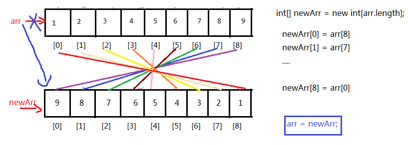
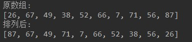
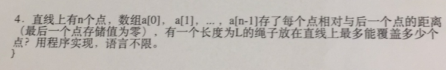

# JavaSE_day14【基础API与常见算法】

## 主要内容

* 常用类
* 基础算法

## 学习目标

* [ ] 了解数学相关API
* [ ] 了解日期时间API
* [ ] 了解系统类API
* [ ] 掌握数组基础算法
* [ ] 掌握数组工具类的使用

# 第十章 基础API与常见算法

## 10.1 和数学相关的类

### 10.1.1 java.lang.Math

`java.lang.Math` 类包含用于执行基本数学运算的方法，如初等指数、对数、平方根和三角函数。类似这样的工具类，其所有方法均为静态方法，并且不会创建对象，调用起来非常简单。

* `public static double abs(double a) ` ：返回 double 值的绝对值。 

```java
double d1 = Math.abs(-5); //d1的值为5
double d2 = Math.abs(5); //d2的值为5
```

* `public static double ceil(double a)` ：返回大于等于参数的最小的整数。

```java
double d1 = Math.ceil(3.3); //d1的值为 4.0
double d2 = Math.ceil(-3.3); //d2的值为 -3.0
double d3 = Math.ceil(5.1); //d3的值为 6.0
```

* `public static double floor(double a) ` ：返回小于等于参数最大的整数。

```java
double d1 = Math.floor(3.3); //d1的值为3.0
double d2 = Math.floor(-3.3); //d2的值为-4.0
double d3 = Math.floor(5.1); //d3的值为 5.0
```

* `public static long round(double a)` ：返回最接近参数的 long。(相当于四舍五入方法)  

```java
long d1 = Math.round(5.5); //d1的值为6.0
long d2 = Math.round(5.4); //d2的值为5.0
```

* public static double pow(double a,double b)：返回a的b幂次方法
* public static double sqrt(double a)：返回a的平方根
* public static double random()：返回[0,1)的随机值
* public static final double PI：返回圆周率
* public static double max(double x, double y)：返回x,y中的最大值
* public static double min(double x, double y)：返回x,y中的最小值

```java
double result = Math.pow(2,31);
double sqrt = Math.sqrt(256);
double rand = Math.random();
double pi = Math.PI;
```

##### 练习 

请使用`Math` 相关的API，计算在 `-10.8`  到`5.9`  之间，绝对值大于`6`  或者小于`2.1` 的整数有多少个？

```java
public class MathTest {
  public static void main(String[] args) {
    // 定义最小值
    double min = -10.8;
    // 定义最大值
    double max = 5.9;
    // 定义变量计数
    int count = 0;
    // 范围内循环
    for (double i = Math.ceil(min); i <= max; i++) {
      // 获取绝对值并判断
      if (Math.abs(i) > 6 || Math.abs(i) < 2.1) {
        // 计数
        count++;
      }
    }
    System.out.println("个数为: " + count + " 个");
  }
}
```

### 10.1.2 java.math包

#### （1）BigInteger

不可变的任意精度的整数。

* BigInteger(String val) 
* BigInteger add(BigInteger val)  
* BigInteger subtract(BigInteger val)
* BigInteger multiply(BigInteger val) 
* BigInteger divide(BigInteger val) 
* BigInteger remainder(BigInteger val)
* ....

```java
	@Test
	public void test01(){
//		long bigNum = 123456789123456789123456789L;
		
		BigInteger b1 = new BigInteger("123456789123456789123456789");
		BigInteger b2 = new BigInteger("78923456789123456789123456789");
		
//		System.out.println("和：" + (b1+b2));//错误的，无法直接使用+进行求和
		
		System.out.println("和：" + b1.add(b2));
		System.out.println("减：" + b1.subtract(b2));
		System.out.println("乘：" + b1.multiply(b2));
		System.out.println("除：" + b2.divide(b1));
		System.out.println("余：" + b2.remainder(b1));
	}
```

#### （2）RoundingMode枚举类

CEILING ：向正无限大方向舍入的舍入模式。 
DOWN ：向零方向舍入的舍入模式。 
FLOOR：向负无限大方向舍入的舍入模式。 
HALF_DOWN ：向最接近数字方向舍入的舍入模式，如果与两个相邻数字的距离相等，则向下舍入。 
HALF_EVEN：向最接近数字方向舍入的舍入模式，如果与两个相邻数字的距离相等，则向相邻的偶数舍入。 
HALF_UP：向最接近数字方向舍入的舍入模式，如果与两个相邻数字的距离相等，则向上舍入。 
UNNECESSARY：用于断言请求的操作具有精确结果的舍入模式，因此不需要舍入。 
UP：远离零方向舍入的舍入模式。 

#### （3）BigDecimal

不可变的、任意精度的有符号十进制数。

* BigDecimal(String val) 
* BigDecimal add(BigDecimal val) 
* BigDecimal subtract(BigDecimal val)
* BigDecimal multiply(BigDecimal val) 
* BigDecimal divide(BigDecimal val) 
* BigDecimal divide(BigDecimal divisor, int roundingMode) 
* BigDecimal divide(BigDecimal divisor, int scale, RoundingMode roundingMode) 
* BigDecimal remainder(BigDecimal val) 
* ....

```java
	@Test
	public void test02(){
		/*double big = 12.123456789123456789123456789;
		System.out.println("big = " + big);*/
		
		BigDecimal b1 = new BigDecimal("123.45678912345678912345678912345678");
		BigDecimal b2 = new BigDecimal("7.8923456789123456789123456789998898888");
		
//		System.out.println("和：" + (b1+b2));//错误的，无法直接使用+进行求和
		
		System.out.println("和：" + b1.add(b2));
		System.out.println("减：" + b1.subtract(b2));
		System.out.println("乘：" + b1.multiply(b2));
		System.out.println("除：" + b1.divide(b2,20,RoundingMode.UP));//divide(BigDecimal divisor, int scale, int roundingMode)
		System.out.println("除：" + b1.divide(b2,20,RoundingMode.DOWN));//divide(BigDecimal divisor, int scale, int roundingMode)
		System.out.println("余：" + b1.remainder(b2));
	}
```

### 10.1.3 java.util.Random

用于产生随机数

* boolean nextBoolean():返回下一个伪随机数，它是取自此随机数生成器序列的均匀分布的 boolean 值。 

* void nextBytes(byte[] bytes):生成随机字节并将其置于用户提供的 byte 数组中。 

* double nextDouble():返回下一个伪随机数，它是取自此随机数生成器序列的、在 0.0 和 1.0 之间均匀分布的 double 值。 

* float nextFloat():返回下一个伪随机数，它是取自此随机数生成器序列的、在 0.0 和 1.0 之间均匀分布的 float 值。 

* double nextGaussian():返回下一个伪随机数，它是取自此随机数生成器序列的、呈高斯（“正态”）分布的 double 值，其平均值是 0.0，标准差是 1.0。 

* int nextInt():返回下一个伪随机数，它是此随机数生成器的序列中均匀分布的 int 值。 

* int nextInt(int n):返回一个伪随机数，它是取自此随机数生成器序列的、在 0（包括）和指定值（不包括）之间均匀分布的 int 值。 

* long nextLong():返回下一个伪随机数，它是取自此随机数生成器序列的均匀分布的 long 值。 

```java
	@Test
	public void test03(){
		Random r = new Random();
		System.out.println("随机整数：" + r.nextInt());
		System.out.println("随机小数：" + r.nextDouble());
		System.out.println("随机布尔值：" + r.nextBoolean());
	}
```

## 10.2 日期时间API

### 10.2.1 JDK1.8之前

#### 1、java.util.Date

new  Date()：当前系统时间

long  getTime()：返回该日期时间对象距离1970-1-1 0.0.0 0毫秒之间的毫秒值

new Date(long 毫秒)：把该毫秒值换算成日期时间对象

```java
	@Test
	public void test5(){
		long time = Long.MAX_VALUE;
		Date d = new Date(time);
		System.out.println(d);
	}
	
	@Test
	public void test4(){
		long time = 1559807047979L;
		Date d = new Date(time);
		System.out.println(d);
	}
	@Test
	public void test3(){
		Date d = new Date();
		long time = d.getTime();
		System.out.println(time);//1559807047979
	}
	
	@Test
	public void test2(){
		long time = System.currentTimeMillis();
		System.out.println(time);//1559806982971
		//当前系统时间距离1970-1-1 0:0:0 0毫秒的时间差，毫秒为单位
	}
	
	@Test
	public void test1(){
		Date d = new Date();
		System.out.println(d);
	}
```

#### 2、java.util.TimeZone

通常，使用 `getDefault` 获取 `TimeZone`，`getDefault`  基于程序运行所在的时区创建 `TimeZone`。

也可以用 `getTimeZone` 及时区 ID 获取 `TimeZone` 。例如美国太平洋时区的时区 ID 是  "America/Los_Angeles"。

```java
	@Test
	public void test8(){
		String[] all = TimeZone.getAvailableIDs();
		for (int i = 0; i < all.length; i++) {
			System.out.println(all[i]);
		}
	}
	
	@Test
	public void test7(){
		TimeZone t = TimeZone.getTimeZone("America/Los_Angeles");
	}
```

常见时区ID：

```java
Asia/Shanghai
UTC
America/New_York
```


#### 3、java.util.Calendar

`Calendar` 类是一个抽象类，它为特定瞬间与一组诸如  `YEAR`、`MONTH`、`DAY_OF_MONTH`、`HOUR`  等 [`日历字段`](../../java/util/Calendar.html#fields)之间的转换提供了一些方法，并为操作日历字段（例如获得下星期的日期）提供了一些方法。瞬间可用毫秒值来表示，它是距*历元*（即格林威治标准时间 1970 年 1 月 1 日的 00:00:00.000，格里高利历）的偏移量。与其他语言环境敏感类一样，`Calendar` 提供了一个类方法  `getInstance`，以获得此类型的一个通用的对象。

（1）getInstance()：得到Calendar的对象

（2）get(常量)

```java
	@Test
	public void test6(){
		Calendar c = Calendar.getInstance();
		System.out.println(c);
		
		int year = c.get(Calendar.YEAR);
		System.out.println(year);
		
		int month = c.get(Calendar.MONTH)+1;
		System.out.println(month);
		
		//...
	}

	@Test
	public void test7(){
		TimeZone t = TimeZone.getTimeZone("America/Los_Angeles");
		
		//getInstance(TimeZone zone)
		Calendar c = Calendar.getInstance(t);
		System.out.println(c);
	}
```

#### 4、java.text.SimpleDateFormat

SimpleDateFormat用于日期时间的格式化。


```java
	@Test
	public void test10() throws ParseException{
		String str = "2019年06月06日 16时03分14秒 545毫秒  星期四 +0800";
		SimpleDateFormat sf = new SimpleDateFormat("yyyy年MM月dd日 HH时mm分ss秒 SSS毫秒  E Z");
		Date d = sf.parse(str);
		System.out.println(d);
	}
	
	@Test
	public void test9(){
		Date d = new Date();

		SimpleDateFormat sf = new SimpleDateFormat("yyyy年MM月dd日 HH时mm分ss秒 SSS毫秒  E Z");
		//把Date日期转成字符串，按照指定的格式转
		String str = sf.format(d);
		System.out.println(str);
	}
```

### 10.2.2 JDK1.8之后

Java1.0中包含了一个Date类，但是它的大多数方法已经在Java 1.1引入Calendar类之后被弃用了。而Calendar并不比Date好多少。它们面临的问题是：

* 可变性：象日期和时间这样的类对象应该是不可变的。Calendar类中可以使用三种方法更改日历字段：set()、add() 和 roll()。
* 偏移性：Date中的年份是从1900开始的，而月份都是从0开始的。
* 格式化：格式化只对Date有用，Calendar则不行。
* 此外，它们也不是线程安全的，不能处理闰秒等。

可以说，对日期和时间的操作一直是Java程序员最痛苦的地方之一。第三次引入的API是成功的，并且java 8中引入的java.time API 已经纠正了过去的缺陷，将来很长一段时间内它都会为我们服务。

Java 8 吸收了 Joda-Time 的精华，以一个新的开始为 Java 创建优秀的 API。

* java.time – 包含值对象的基础包
* java.time.chrono – 提供对不同的日历系统的访问。
* java.time.format – 格式化和解析时间和日期
* java.time.temporal – 包括底层框架和扩展特性
* java.time.zone – 包含时区支持的类

Java 8 吸收了 Joda-Time 的精华，以一个新的开始为 Java 创建优秀的 API。新的 java.time 中包含了所有关于时钟（Clock），本地日期（LocalDate）、本地时间（LocalTime）、本地日期时间（LocalDateTime）、时区（ZonedDateTime）和持续时间（Duration）的类。

#### 1、本地日期时间：LocalDate、LocalTime、LocalDateTime

| 方法                                                         | **描述**                                                     |
| ------------------------------------------------------------ | ------------------------------------------------------------ |
| now() / now(ZoneId zone)                                     | 静态方法，根据当前时间创建对象/指定时区的对象                |
| of()                                                         | 静态方法，根据指定日期/时间创建对象                          |
| getDayOfMonth()/getDayOfYear()                               | 获得月份天数(1-31) /获得年份天数(1-366)                      |
| getDayOfWeek()                                               | 获得星期几(返回一个 DayOfWeek 枚举值)                        |
| getMonth()                                                   | 获得月份, 返回一个 Month 枚举值                              |
| getMonthValue() / getYear()                                  | 获得月份(1-12) /获得年份                                     |
| getHours()/getMinute()/getSecond()                           | 获得当前对象对应的小时、分钟、秒                             |
| withDayOfMonth()/withDayOfYear()/withMonth()/withYear()      | 将月份天数、年份天数、月份、年份修改为指定的值并返回新的对象 |
| with(TemporalAdjuster  t)                                    | 将当前日期时间设置为校对器指定的日期时间                     |
| plusDays(), plusWeeks(), plusMonths(), plusYears(),plusHours() | 向当前对象添加几天、几周、几个月、几年、几小时               |
| minusMonths() / minusWeeks()/minusDays()/minusYears()/minusHours() | 从当前对象减去几月、几周、几天、几年、几小时                 |
| plus(TemporalAmount t)/minus(TemporalAmount t)               | 添加或减少一个 Duration 或 Period                            |
| isBefore()/isAfter()                                         | 比较两个 LocalDate                                           |
| isLeapYear()                                                 | 判断是否是闰年（在LocalDate类中声明）                        |
| format(DateTimeFormatter  t)                                 | 格式化本地日期、时间，返回一个字符串                         |
| parse(Charsequence text)                                     | 将指定格式的字符串解析为日期、时间                           |

```java
	@Test
	public void test7(){
		LocalDate now = LocalDate.now();
		LocalDate before = now.minusDays(100);
		System.out.println(before);//2019-02-26
	}
	
	@Test
	public void test06(){
		LocalDate lai = LocalDate.of(2019, 5, 13);
		LocalDate go = lai.plusDays(160);
		System.out.println(go);//2019-10-20
	}
	
	@Test
	public void test05(){
		LocalDate lai = LocalDate.of(2019, 5, 13);
		System.out.println(lai.getDayOfYear());
	}
	
	
	@Test
	public void test04(){
		LocalDate lai = LocalDate.of(2019, 5, 13);
		System.out.println(lai);
	}
	
	@Test
	public void test03(){
		LocalDateTime now = LocalDateTime.now();
		System.out.println(now);
	}
	
	@Test
	public void test02(){
		LocalTime now = LocalTime.now();
		System.out.println(now);
	}
	
	@Test
	public void test01(){
		LocalDate now = LocalDate.now();
		System.out.println(now);
	}
```

#### 2、指定时区日期时间：ZonedDateTime

常见时区ID：

```java
Asia/Shanghai
UTC
America/New_York
```


```java
import java.time.ZoneId;
import java.time.ZonedDateTime;

public class TestZonedDateTime {
	public static void main(String[] args) {
		ZonedDateTime t = ZonedDateTime.now();
		System.out.println(t);
		
		ZonedDateTime t1 = ZonedDateTime.now(ZoneId.of("America/New_York"));
		System.out.println(t1);
	}
}
```

#### 3、持续日期/时间：Period和Duration

Period:用于计算两个“日期”间隔

```java
public static void main(String[] args) {
		LocalDate t1 = LocalDate.now();
		LocalDate t2 = LocalDate.of(2018, 12, 31);
		Period between = Period.between(t1, t2);
		System.out.println(between);
		
		System.out.println("相差的年数："+between.getYears());//1年
		System.out.println("相差的月数："+between.getMonths());//又7个月
		System.out.println("相差的天数："+between.getDays());//零25天
		System.out.println("相差的总数："+between.toTotalMonths());//总共19个月
	}
```

Duration:用于计算两个“时间”间隔

```java
	public static void main(String[] args) {
		LocalDateTime t1 = LocalDateTime.now();
		LocalDateTime t2 = LocalDateTime.of(2017, 8, 29, 0, 0, 0, 0);
		Duration between = Duration.between(t1, t2);
		System.out.println(between);
		
		System.out.println("相差的总天数："+between.toDays());
		System.out.println("相差的总小时数："+between.toHours());
		System.out.println("相差的总分钟数："+between.toMinutes());
		System.out.println("相差的总秒数："+between.getSeconds());
		System.out.println("相差的总毫秒数："+between.toMillis());
		System.out.println("相差的总纳秒数："+between.toNanos());
		System.out.println("不够一秒的纳秒数："+between.getNano());
	}
```

#### 4、DateTimeFormatter：日期时间格式化

该类提供了三种格式化方法：

预定义的标准格式。如：ISO_DATE_TIME;ISO_DATE

本地化相关的格式。如：ofLocalizedDate(FormatStyle.MEDIUM)

自定义的格式。如：ofPattern(“yyyy-MM-dd hh:mm:ss”)

```java
	@Test
	public void test10(){
		LocalDateTime now = LocalDateTime.now();
		
//		DateTimeFormatter df = DateTimeFormatter.ofLocalizedDateTime(FormatStyle.LONG);//2019年6月6日 下午04时40分03秒
		DateTimeFormatter df = DateTimeFormatter.ofLocalizedDateTime(FormatStyle.SHORT);//19-6-6 下午4:40
		String str = df.format(now);
		System.out.println(str);
	}
	@Test
	public void test9(){
		LocalDateTime now = LocalDateTime.now();
		
		DateTimeFormatter df = DateTimeFormatter.ISO_DATE_TIME;//2019-06-06T16:38:23.756
		String str = df.format(now);
		System.out.println(str);
	}
	
	@Test
	public void test8(){
		LocalDateTime now = LocalDateTime.now();
		
		DateTimeFormatter df = DateTimeFormatter.ofPattern("yyyy年MM月dd日 HH时mm分ss秒  SSS毫秒  E 是这一年的D天");
		String str = df.format(now);
		System.out.println(str);
	}
```


## 10.3 系统相关类

### 10.3.1 java.lang.System类

系统类中很多好用的方法，其中几个如下：

* static long currentTimeMillis() ：返回当前系统时间距离1970-1-1 0:0:0的毫秒值

* static void arraycopy(Object src, int srcPos, Object dest, int destPos, int length)： 

  从指定源数组中复制一个数组，复制从指定的位置开始，到目标数组的指定位置结束。常用于数组的插入和删除

* static void exit(int status) ：退出当前系统

* static void gc() ：运行垃圾回收器。

* static String getProperty(String key)：获取某个系统属性

* ...

```java
public class Test{
    public static void main(String[] args){
    	long time = System.currentTimeMillis();
    	System.out.println("现在的系统时间距离1970年1月1日凌晨：" + time + "毫秒");
    	
    	System.exit(0);

    	System.out.println("over");//不会执行
    }
}
```

```

```

### 10.3.3 java.lang.Runtime类

每个 Java 应用程序都有一个 `Runtime` 类实例，使应用程序能够与其运行的环境相连接。可以通过  `getRuntime` 方法获取当前运行时。  应用程序不能创建自己的 Runtime 类实例。

public static Runtime getRuntime()： 返回与当前 Java 应用程序相关的运行时对象。

public long totalMemory()：返回 Java 虚拟机中的内存总量。此方法返回的值可能随时间的推移而变化，这取决于主机环境。

public long freeMemory()：回 Java 虚拟机中的空闲内存量。调用 gc 方法可能导致 freeMemory 返回值的增加。

```

```

## 10.4 数组的算法升华

### 10.4.1 数组的算法升华

#### 1、数组的反转

方法有两种：

1、借助一个新数组

2、首尾对应位置交换

第一种方式示例代码：



```java
int[] arr = {1,2,3,4,5,6,7,8,9};

//(1)先创建一个新数组
int[] newArr = new int[arr.length];

//(2)复制元素
int len = arr.length;
for(int i=0; i<newArr.length; i++){
    newArr[i] = arr[len -1 - i];
}

//(3)舍弃旧的，让arr指向新数组
arr = newArr;//这里把新数组的首地址赋值给了arr

//(4)遍历显示
for(int i=0; i<arr.length; i++){
    System.out.println(arr[i]);
}

```

> 缺点：需要借助一个数组，浪费额外空间，原数组需要垃圾回收

第二种方式示例代码：

**实现思想：**数组对称位置的元素互换。


```java
int[] arr = {1,2,3,4,5,6,7,8,9};

//(1)计算要交换的次数：  次数 = arr.length/2
//(2)首尾对称位置交换
for(int i=0; i<arr.length/2; i++){//循环的次数就是交换的次数
    int temp = arr[i];
    arr[i] = arr[arr.length-1-i];
	arr[arr.length-1-i] = temp;
}

//（3）遍历显示
for(int i=0; i<arr.length; i++){
    System.out.println(arr[i]);
}
```

或


```java
	public static void main(String[] args){
		int[] arr = {1,2,3,4,5,6,7,8,9};

		//左右对称位置交换
		for(int left=0,right=arr.length-1; left<right; left++,right--){
		    //首  与  尾交换
		    int temp = arr[left];
		    arr[left] = arr[right];
			arr[right] = temp;
		}

		//（3）遍历显示
		for(int i=0; i<arr.length; i++){
		    System.out.println(arr[i]);
		}
	}
```


#### 2、数组的扩容

示例：当原来的数组长度不够了需要扩容，例如需要新增位置来存储10

```java
int[] arr = {1,2,3,4,5,6,7,8,9};

//如果要把arr数组扩容，增加1个位置
//(1)先创建一个新数组，它的长度 = 旧数组的长度+1，或者也可以扩大为原来数组长度的1.5倍，2倍等
int[] newArr = new int[arr.length + 1];

//(2)复制元素
//注意：i<arr.length   因位arr比newArr短，避免下标越界
for(int i=0; i<arr.length; i++){
    newArr[i] = arr[i];
}

//(3)把新元素添加到newArr的最后
newArr[newArr.length-1] = 10;

//(4)如果下面继续使用arr，可以让arr指向新数组
arr = newArr;

//(4)遍历显示
for(int i=0; i<arr.length; i++){
    System.out.println(arr[i]);
}
```

> （1）至于新数组的长度定义多少合适，看实际情况，如果新增的元素个数确定，那么可以增加指定长度，如果新增元素个数不确定，那么可以扩容为原来的1.5倍、2倍等
>
> （2）数组扩容太多会造成浪费，太少会导致频繁扩容，效率低下

#### 3、数组元素的插入

示例：在原数组的某个[index]插入一个元素

情形一：原数组未满

```java
String[] arr = new String[5];
arr[0]="张三";
arr[1]="李四";
arr[2]="王五";

那么目前数组的长度是5，而数组的实际元素个数是3，如果此时需要在“张三”和“李四”之间插入一个“赵六”，即在[index=1]的位置插入“赵六”，需要怎么做呢？
```

```java
String[] arr = new String[5];
arr[0]="张三";
arr[1]="李四";
arr[2]="王五";

//（1）移动2个元素，需要移动的起始元素下标是[1]，它需要移动到[2]，一共一共2个
System.arraycopy(arr,1,arr,2,2);
//（2）插入新元素
arr[1]="赵六";

//(3)遍历显示
for(int i=0; i<arr.length; i++){
    System.out.println(arr[i]);
}
```

情形二：原数组已满

```java
String[] arr = new String[3];
arr[0]="张三";
arr[1]="李四";
arr[2]="王五";

那么目前数组的长度是3，而数组的实际元素个数是3，如果此时需要在“张三”和“李四”之间插入一个“赵六”，即在[index=1]的位置插入“赵六”，需要怎么做呢？
```

```java
String[] arr = new String[3];
arr[0]="张三";
arr[1]="李四";
arr[2]="王五";

//（1）先扩容
String[] newArr = new String[4];
for(int i=0; i<arr.length; i++){
	newArr[i] = arr[i];
}
arr=newArr;

//（2）移动2个元素，需要移动的起始元素下标是[1]，它需要移动到[2]，一共一共2个
System.arraycopy(arr,1,arr,2,2);
//（3）插入新元素
arr[1]="赵六";

//(4)遍历显示
for(int i=0; i<arr.length; i++){
    System.out.println(arr[i]);
}
```

#### 4、数组元素的删除

示例：

```java
String[] arr = new String[3];
arr[0]="张三";
arr[1]="李四";
arr[2]="王五";

现在需要删除“李四”，我们又不希望数组中间空着元素，该如何处理呢？
```

```java
String[] arr = new String[3];
arr[0]="张三";
arr[1]="李四";
arr[2]="王五";

//（1）移动元素，需要移动元素的起始下标[2]，该元素需要移动到[1]，一共需要移动1个元素
System.arraycopy(arr,2,arr,1,1);

//（2）因为数组元素整体往左移动，这里本质上是复制，原来最后一个元素需要置空
arr[2]=null;//使得垃圾回收尽快回收对应对象的内存
```


#### 5、数组的二分查找

二分查找：对折对折再对折

要求：要求数组元素必须支持比较大小，并且数组中的元素已经按大小排好序

示例：

```java
class Exam2{
	public static void main(String[] args){
		int[] arr = {2,5,7,8,10,15,18,20,22,25,28};//数组是有序的
		int value = 18;
		
        int index = -1;
		int left = 0;
        int right = arr.length - 1;
        int mid = (left + right)/2;
        while(left<=right){
            //找到结束
            if(value == arr[mid]){
                index = mid;
                break;
            }//没找到
            else if(value > arr[mid]){//往右继续查找
                //移动左边界，使得mid往右移动
                left = mid + 1;
            }else if(value < arr[mid]){//往左边继续查找
                right = mid - 1;
            }
            
            mid = (left + right)/2;
        }
        
        if(index==-1){
    		System.out.println(value + "不存在");
		}else{
    		System.out.println(value + "的下标是" + index);
		}
        
	}
}
```


#### 6、数组的直接选择排序

示例代码：简单的直接选择排序

```java
int[] arr = {49,38,65,97,76,13,27,49};

for(int i=1; i<arr.length; i++){//外循环的次数 = 轮数 = 数组的长度-1
    //（1）找出本轮未排序元素中的最值
    /*
    未排序元素：
    第1轮：i=1,未排序，[0,7]，本轮未排序元素第一个元素是[0]
    第2轮：i=2,未排序，[1,7]，本轮未排序元素第一个元素是[1]
    ...
    第7轮：i=7,未排序，[6,7]，本轮未排序元素第一个元素是[6]
    
    每一轮未排序元素的起始下标：0,1,2,3,4,5,6，正好是i-1的
    未排序的后面的元素依次：
    第1轮：[1,7]  j=1,2,3,4,5,6,7
    第2轮：[2,4]  j=2,3,4,5,6,7
    。。。。
    第7轮：[7]    j=7
    j的起点是i，终点都是7
    */
    int max = arr[i-1];
    int index = i-1;
    for(int j=i; j<arr.length; j++){
        if(arr[j] > max){
            max = arr[j];
            index = j;
        }
    }
    
    //（2）如果这个最值没有在它应该在的位置，就与这个位置的元素交换
    /*
    第1轮，最大值应该在[0]
    第2轮，最大值应该在[1]
    ....
    第7轮，最大值应该在[6]
    正好是i-1的值
    */
    if(index != i-1){
        //交换arr[i-1]与arr[index]
        int temp = arr[i-1];
        arr[i-1] = arr[index];
        arr[index] = temp;
    }
}

//显示结果
for(int i=0; i<arr.length; i++){
	System.out.print(arr[i]);
}
```


### 10.4.2 数组工具类

java.util.Arrays数组工具类，提供了很多静态方法来对数组进行操作，而且如下每一个方法都有各种重载形式，以下只列出int[]类型的，其他类型的数组类推：

* static int binarySearch(int[] a, int key) ：要求数组有序，在数组中查找key是否存在，如果存在返回第一次找到的下标，不存在返回负数

* static int[] copyOf(int[] original, int newLength)  ：根据original原数组复制一个长度为newLength的新数组，并返回新数组

* static int[] copyOfRange(int[] original, int from, int to) ：复制original原数组的[from,to)构成新数组，并返回新数组

* static boolean equals(int[] a, int[] a2) ：比较两个数组的长度、元素是否完全相同

* static void fill(int[] a, int val) ：用val填充整个a数组
* static void fill(int[] a, int fromIndex, int toIndex, int val)：将a数组[fromIndex,toIndex)部分填充为val 
* static void sort(int[] a) ：将a数组按照从小到大进行排序
* static void sort(int[] a, int fromIndex, int toIndex) ：将a数组的[fromIndex, toIndex)部分按照升序排列
* static String toString(int[] a) ：把a数组的元素，拼接为一个字符串，形式为：[元素1，元素2，元素3。。。]

示例代码：

```java
import java.util.Arrays;
import java.util.Random;

public class Test{
    public static void main(String[] args){
    	int[] arr = new int[5];
        // 打印数组,输出地址值
  		System.out.println(arr); // [I@2ac1fdc4
  		// 数组内容转为字符串
    	System.out.println("arr数组初始状态："+ Arrays.toString(arr));
    	
    	Arrays.fill(arr, 3);
    	System.out.println("arr数组现在状态："+ Arrays.toString(arr));
    	
    	Random rand = new Random();
    	for (int i = 0; i < arr.length; i++) {
			arr[i] = rand.nextInt(100);//赋值为100以内的随机整数
		}
    	System.out.println("arr数组现在状态："+ Arrays.toString(arr));
    	
    	int[] arr2 = Arrays.copyOf(arr, 10);
    	System.out.println("新数组：" + Arrays.toString(arr2));
    	
    	System.out.println("两个数组的比较结果：" + Arrays.equals(arr, arr2));
    	
    	Arrays.sort(arr);
    	System.out.println("arr数组现在状态："+ Arrays.toString(arr));
    }
}
```

### 10.4.3 数组面试题

#### 1、编程题1

找出数组中一个值，使其左侧值的加和等于右侧值的加和，

​	例如：[1,2,5,3,2,4,2]，结果为：第4个值3

​			    [9, 6, 8, 8, 7, 6, 9, 5, 2, 5]，结果是没有

```java
	public static void main(String[] args) {
		int[] arr = {1,2,5,3,2,4,2};
			
		int index = leftSumEqualsRightSum(arr);
		if(index!=-1) {
			System.out.println(arr[index]);
		}else {
			System.out.println("没有");
		}
	}
	
	public static int leftSumEqualsRightSum(int[] arr) {
		for (int mid = 0; mid < arr.length; mid++) {
			int leftSum = 0;
			int rightSum = 0;
			for (int i = 0; i <mid; i++) {
				leftSum += arr[i];
			}
			for (int i = mid+1; i < arr.length; i++) {
				rightSum += arr[i];
			}
			if(leftSum==rightSum) {
				return mid;
			}
		}
		return -1;
	}
```

#### 2、编程题2

- 左奇右偶

  -  10个整数的数组{26,67,49,38,52,66,7,71,56,87}。
  -  元素重新排列，所有的奇数保存到数组左边，所有的偶数保存到数组右边。

- 代码实现，效果如图所示：

  

- 开发提示：

  - 左边的偶数与右边的奇数换位置：
  - 定义两个变量left和right，从左边开始查找偶数的位置，找到后用left记录，从右边开始找奇数的位置，找到后用right记录，如果left<right，那么就交换，然后在上一次的基础上继续查找，直到left与right擦肩。

```java
    //效率最高
    public void order2(int[] arr){
        for (int left = 0,right = arr.length-1; left < right; ){
            //left代表左边需要交换的数的下标，偶数的下标
            //如果arr[left]此时是奇数，说明此时left不是我们要找的下标，left++往后移动
            while(arr[left]%2!=0){//当arr[left]是偶数时，结束while循环
                left++;
            }
            //如果arr[right]此时是偶数，说明此时right不是我们要找的下标，right--往前移动
            while(arr[right]%2==0){//当arr[right]是奇数时，结束while循环
                right--;
            }
            if(left < right){
                int temp = arr[left];
                arr[left] = arr[right];
                arr[right]= temp;
            }
        }
    }
```

```java
public void order3(int[] arr){
        int len = arr.length;
        while (len>0) {
            for (int j=0; j<len-1; j++){
                //左边的元素是偶数，就和它相邻的元素交换
                if (arr[j]%2==0) {
                    int temp = arr[j];
                    arr[j] = arr[j+1];
                    arr[j+1] = temp;
                }
            }
            len--;
        }
    }
```

```java
public void order(int[] arr){
        //从左边往右边找偶数，记录下标，evenIndex，这个是错误的数字的下标
        //从右边往左边找奇数，记录下标，oddIndex，这个是错误的数字的下标
        //交换arr[oddIndex]与arr[evenIndex]，调整之后就可以了
        int evenIndex = 0;
        int oddIndex = arr.length-1;
        while(evenIndex < oddIndex){
            for (int i=0; i<arr.length; i++){
                if(arr[i]%2==0){
                    evenIndex = i;
                    break;
                }
            }

            for(int i=arr.length-1; i>=0; i--){
                if(arr[i]%2!=0){
                    oddIndex = i;
                    break;
                }
            }

            if(evenIndex < oddIndex) {
                int temp = arr[evenIndex];
                arr[evenIndex] = arr[oddIndex];
                arr[oddIndex] = temp;
            }
        }
    }
```


#### 3、编程题3

* 数组去重

  * 10个整数{9,10,6,6,1,9,3,5,6,4}，范围1-10，保存到数组中。
  * 去除数组中重复的内容，只保留唯一的元素。

* 按步骤编写代码，效果如图所示：

  

* 开发提示：

  - 定义一个变量count，初始化为数组的长度
  - 遍历每一个元素，如果该元素与前面的某个元素相等，那么通过移动数组，把该元素覆盖掉，并修改count--。
  - 最后创建一个新数组，长度为count，并从原数组把前count个元素复制过来

#### 4、编程题4



```java
import java.util.Arrays;

public class TestExer4 {
	public static void main(String[] args) {
		
		double[] arr = new double[10];
		for (int i = 0; i < arr.length-1; i++) {
			arr[i] = Math.random() * 100;//[0,100)之间的小数
		}
		arr[arr.length-1] = 0;
		System.out.println("直线上每一个点距离下一个点的距离："+Arrays.toString(arr));
		
		double length = 150.5;
		
		int count = 0;
		double sum = 0;
		for (int i = 0; i < arr.length; i++) {
			sum += arr[i];
			if(sum<=length) {
				count++;
			}else {
				break;
			}
		}
		System.out.println("长度为：" + length + "的绳子最多能覆盖" +count+"个点");
	}
}
```


#### 5、编程题5


冒泡排序：

```java
public static void bubbleSort(int[] arr) {
		for (int i = 1; i < arr.length; i++) {
			for (int j = 0; j < arr.length-i; j++) {
				if(arr[j] > arr[j+1]) {
					int temp = arr[j];
					arr[j] = arr[j+1];
					arr[j+1] = temp;
				}
			}
		}
	}
```

直接选择排序：

```java
public static void selectSort(int[] arr) {
		for (int i = 0; i < arr.length-1; i++) {
			int minIndex = i;
			for (int j = i+1; j < arr.length; j++) {
				if(arr[minIndex] > arr[j]) {
					minIndex = j;
				}
			}
			if(minIndex!=i) {
				int temp = arr[minIndex];
				arr[minIndex] = arr[i];
				arr[i] = temp;
			}
		}
	}
```

### 10.4.4 附加

#### 1、折半插入排序

例如：数组{12,2,6,1,5}

第一次：在[0,1)之间找插入2的位置==>left = [0] ==> {2,12,6,1,5}

第二次：在[0,2)之间找插入6的位置==>left = [1] ==> {2,6,12,1,5}

第三次：在[0,3)之间找插入1的位置==>left = [0] ==>{1,2,6,12,5}

第四次：在[0,4)之间找插入5的位置==>left = [2] ==>{1,2,5,6,12}

```java
    @Test
    public void test(){
        int[] arr = {12,2,6,1,5};
        sort(arr);
        System.out.println(Arrays.toString(arr));
    }

    public void sort(int[] arr){
        for (int i=1; i<arr.length; i++){
            //找到[0,i)之间插入arr[i]的位置
            //使用二分查找法
            int left = 0;
            int right=i-1;
            while (left<=right){
                int mid = (left + right)/2;
                if(arr[i]<=arr[mid]){
                    right = mid - 1;
                }else{
                    left = mid + 1;
                }
            }
 
            //在[0,i)插入arr[i]
            if(left < i){
                int temp = arr[i];
                System.arraycopy(arr,left,arr,left+1,i-left);
                arr[left] = temp;
            }
        }
    }
```


#### 2、快速排序

例如：数组{5, 2, 6, 12, 1,7,9}

```java
    @Test
    public void test(){
        int[] arr = {5, 2, 6, 12, 1,7,9};
        sort(arr,0, arr.length-1);
        System.out.println(Arrays.toString(arr));
    }

    //将[start+1,end]之间的元素分为两拨，左边的所有元素比arr[start]小，右边的所有元素比arr[start]大
    public void sort(int[] arr,int start, int end){
        if(start < end){
            int left = start+1;
            int right = end;
            while(left<right){
                //从左往右，从[start+1]开始找比arr[start]大的数arr[left]，让它与arr[right]交换
                //当arr[left]大于arr[start]就停止循环，因为此时找到了比arr[start]大的数arr[left]
                while(arr[left]<=arr[start] && left<end){
                    left++;
                }
                
                //从右往左，从[end]开始找比比arr[start]小的数arr[right]，让它与arr[left]交换
               //当arr[right]小于arr[start]就停止循环，因为此时找到了比arr[start]小的数arr[right]
                while(arr[right]>=arr[start] && right>start){
                    right--;
                }
                
                
                if(left < right){
                    int temp = arr[left];
                    arr[left] = arr[right];
                    arr[right] = temp;
                }
            }
            
            //经过上面的while，//如果right>start+1，那么说明在[start+1,end]之间的数分为两拨
            //[start+1,right]之间的是比arr[start]小的数
            //[right,end]之间的是比arr[start]大的数
            //交换arr[start]与arr[right]
            if(right > start + 1){
                int temp = arr[start];
                arr[start] = arr[right];
                arr[right] = temp;
            }
            //此时[start,right-1]之间都是比arr[start]小的数据了，但是它们还未排序
            //此时[right+1,end]之间都是比arr[start]大的数据了，但是它们还未排序
            //所以需要分别对[start,right-1]、[right+1,end]之间元素重复上面的操作继续排序
            sort(arr,start,right-1);
            sort(arr,right+1,end);
        }

    }
```

第1次调用sort(arr,0,6)
交换arr[left=2]与arr[right=4]：[5, 2, 1, 12, 6, 7, 9]
交换基准位置的元素与分界位置的元素：arr[start=0]与arr[right=2]：[1, 2, 5, 12, 6, 7, 9]
第2次调用sort(arr,0,1)
第3次调用sort(arr,0,0)
第4次调用sort(arr,2,1)
第5次调用sort(arr,3,6)
交换基准位置的元素与分界位置的元素：arr[start=3]与arr[right=6]：[1, 2, 5, 9, 6, 7, 12]
第6次调用sort(arr,3,5)
交换基准位置的元素与分界位置的元素：arr[start=3]与arr[right=5]：[1, 2, 5, 7, 6, 9, 12]
第7次调用sort(arr,3,4)
第8次调用sort(arr,3,3)
第9次调用sort(arr,5,4)
第10次调用sort(arr,6,5)
第11次调用sort(arr,7,6)


