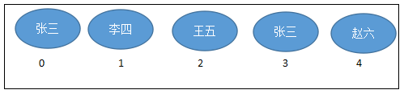

# JavaSE_day17【Collection与Map集合框架】

## 主要内容

- List集合
- Set集合
- Map集合

## 学习目标

- [ ] 能够说出List集合和Set集合的区别
- [ ] 能够说出List集合各种实现类的区别
- [ ] 能够说出Set集合各种实现类的区别
- [ ] 能够说出Collection集合与Map集合的区别
- [ ] 掌握Map集合的常用API
- [ ] 能够遍历Map集合
- [ ] 能够说出Map集合各种实现类的区别

# 第十二章 集合（续）

## 12.3 List集合

我们掌握了Collection接口的使用后，再来看看Collection接口中的子接口，他们都具备那些特性呢？

### 12.3.1 List接口介绍

`java.util.List`接口继承自`Collection`接口，是单列集合的一个重要分支，习惯性地会将实现了`List`接口的对象称为List集合。

List接口特点：

1. List集合所有的元素是以一种线性方式进行存储的，例如，存元素的顺序是11、22、33。那么集合中，元素的存储就是按照11、22、33的顺序完成的）
2. 它是一个元素存取有序的集合。即元素的存入顺序和取出顺序有保证。
3. 它是一个带有索引的集合，通过索引就可以精确的操作集合中的元素（与数组的索引是一个道理）。
4. 集合中可以有重复的元素，通过元素的equals方法，来比较是否为重复的元素。

List集合类中元素有序、且可重复。这就像银行门口客服，给每一个来办理业务的客户分配序号：第一个来的是“张三”，客服给他分配的是0；第二个来的是“李四”，客服给他分配的1；以此类推，最后一个序号应该是“总人数-1”。



注意：

List集合关心元素是否有序，而不关心是否重复，请大家记住这个原则。例如“张三”可以领取两个号。

### 12.3.2 List接口中常用方法

List作为Collection集合的子接口，不但继承了Collection接口中的全部方法，而且还增加了一些根据元素索引来操作集合的特有方法，如下：

List除了从Collection集合继承的方法外，List 集合里添加了一些根据索引来操作集合元素的方法。

1、添加元素

* void add(int index, E ele)
* boolean addAll(int index, Collection<? extends E> eles)

2、获取元素

* E get(int index)
* List subList(int fromIndex, int toIndex)

3、获取元素索引

* int indexOf(Object obj)
* int lastIndexOf(Object obj)

4、删除和替换元素

* E remove(int index)
* E set(int index, E ele)

List集合特有的方法都是跟索引相关：

```java
public class ListDemo {
    public static void main(String[] args) {
		// 创建List集合对象
    	List<String> list = new ArrayList<String>();
    	
    	// 往 尾部添加 指定元素
    	list.add("图图");
    	list.add("小美");
    	list.add("不高兴");
    	
    	System.out.println(list);
    	// add(int index,String s) 往指定位置添加
    	list.add(1,"没头脑");
    	
    	System.out.println(list);
    	// String remove(int index) 删除指定位置元素  返回被删除元素
    	// 删除索引位置为2的元素 
    	System.out.println("删除索引位置为2的元素");
    	System.out.println(list.remove(2));
    	
    	System.out.println(list);
    	
    	// String set(int index,String s)
    	// 在指定位置 进行 元素替代（改） 
    	// 修改指定位置元素
    	list.set(0, "三毛");
    	System.out.println(list);
    	
    	// String get(int index)  获取指定位置元素
    	
    	// 跟size() 方法一起用  来 遍历的 
    	for(int i = 0;i<list.size();i++){
    		System.out.println(list.get(i));
    	}
    	//还可以使用增强for
    	for (String string : list) {
			System.out.println(string);
		}  	
	}
}
```

> 在JavaSE中List名称的类型有两个，一个是java.util.List集合接口，一个是java.awt.List图形界面的组件，别导错包了。

### 12.3.3 List接口的实现类们

List接口的实现类有很多，常见的有：

ArrayList：动态数组

Vector：动态数组

LinkedList：双向链表

Stack：栈

它们的区别我们在数据结构部分再详细讲解

### 12.3.4 ListIterator

List 集合额外提供了一个 listIterator() 方法，该方法返回一个 ListIterator 对象， ListIterator 接口继承了 Iterator 接口，提供了专门操作 List 的方法：

* void add()：通过迭代器添加元素到对应集合
* void set(Object obj)：通过迭代器替换正迭代的元素
* void remove()：通过迭代器删除刚迭代的元素
* boolean hasPrevious()：如果以逆向遍历列表，往前是否还有元素。
* Object previous()：返回列表中的前一个元素。
* int previousIndex()：返回列表中的前一个元素的索引
* boolean hasNext()
* Object next()
* int nextIndex()

```java
	public static void main(String[] args) {
		List<Student> c = new ArrayList<>();
		c.add(new Student(1,"张三"));
		c.add(new Student(2,"李四"));
		c.add(new Student(3,"王五"));
		c.add(new Student(4,"赵六"));
		c.add(new Student(5,"钱七"));
		
		//从指定位置往前遍历
		ListIterator<Student> listIterator = c.listIterator(c.size());
		while(listIterator.hasPrevious()){
			Student previous = listIterator.previous();
			System.out.println(previous);
		}
	}
```

## 12.4 Set集合

Set接口是Collection的子接口，set接口没有提供额外的方法。但是比`Collection`接口更加严格了。

Set 集合不允许包含相同的元素，如果试把两个相同的元素加入同一个 Set 集合中，则添加操作失败。

Set集合支持的遍历方式和Collection集合一样：foreach和Iterator。

Set的常用实现类有：HashSet、TreeSet、LinkedHashSet。

### 12.6.1 HashSet

HashSet 是 Set 接口的典型实现，大多数时候使用 Set 集合时都使用这个实现类。

`java.util.HashSet`底层的实现其实是一个`java.util.HashMap`支持，然后HashMap的底层物理实现是一个Hash表。（什么是哈希表，下一节在HashMap小节在细讲，这里先不展开）

HashSet 按 Hash 算法来存储集合中的元素，因此具有很好的存取和查找性能。HashSet 集合判断两个元素相等的标准：两个对象通过 hashCode() 方法比较相等，并且两个对象的 equals() 方法返回值也相等。因此，存储到HashSet的元素要重写hashCode和equals方法。

示例代码：定义一个Employee类，该类包含属性：name, birthday，其中 birthday 为 MyDate类的对象；MyDate为自定义类型，包含年、月、日属性。要求 name和birthday一样的视为同一个员工。

```java
public class Employee {
	private String name;
	private MyDate birthday;
	public Employee(String name, MyDate birthday) {
		super();
		this.name = name;
		this.birthday = birthday;
	}
	public Employee() {
		super();
	}
	public String getName() {
		return name;
	}
	public void setName(String name) {
		this.name = name;
	}
	public MyDate getBirthday() {
		return birthday;
	}
	public void setBirthday(MyDate birthday) {
		this.birthday = birthday;
	}
	@Override
	public int hashCode() {
		final int prime = 31;
		int result = 1;
		result = prime * result + ((birthday == null) ? 0 : birthday.hashCode());
		result = prime * result + ((name == null) ? 0 : name.hashCode());
		return result;
	}
	@Override
	public boolean equals(Object obj) {
		if (this == obj)
			return true;
		if (obj == null)
			return false;
		if (getClass() != obj.getClass())
			return false;
		Employee other = (Employee) obj;
		if (birthday == null) {
			if (other.birthday != null)
				return false;
		} else if (!birthday.equals(other.birthday))
			return false;
		if (name == null) {
			if (other.name != null)
				return false;
		} else if (!name.equals(other.name))
			return false;
		return true;
	}
	@Override
	public String toString() {
		return "姓名：" + name + ", 生日：" + birthday;
	}
}
```

```java
public class MyDate {
	private int year;
	private int month;
	private int day;
	public MyDate(int year, int month, int day) {
		super();
		this.year = year;
		this.month = month;
		this.day = day;
	}
	public MyDate() {
		super();
	}
	public int getYear() {
		return year;
	}
	public void setYear(int year) {
		this.year = year;
	}
	public int getMonth() {
		return month;
	}
	public void setMonth(int month) {
		this.month = month;
	}
	public int getDay() {
		return day;
	}
	public void setDay(int day) {
		this.day = day;
	}
	@Override
	public int hashCode() {
		final int prime = 31;
		int result = 1;
		result = prime * result + day;
		result = prime * result + month;
		result = prime * result + year;
		return result;
	}
	@Override
	public boolean equals(Object obj) {
		if (this == obj)
			return true;
		if (obj == null)
			return false;
		if (getClass() != obj.getClass())
			return false;
		MyDate other = (MyDate) obj;
		if (day != other.day)
			return false;
		if (month != other.month)
			return false;
		if (year != other.year)
			return false;
		return true;
	}
	@Override
	public String toString() {
		return year + "-" + month + "-" + day;
	}
}
```

```java
import java.util.HashSet;

public class TestHashSet {
	@SuppressWarnings("all")
	public static void main(String[] args) {
		HashSet<Employee> set = new HashSet<>();
		set.add(new Employee("张三", new MyDate(1990,1,1)));
		//重复元素无法添加，因为MyDate和Employee重写了hashCode和equals方法
		set.add(new Employee("张三", new MyDate(1990,1,1)));
		set.add(new Employee("李四", new MyDate(1992,2,2)));
		
		for (Employee object : set) {
			System.out.println(object);
		}
	}
}
```

### 12.6.2 LinkedHashSet

LinkedHashSet是HashSet的子类，它在HashSet的基础上，在结点中增加两个属性before和after维护了结点的前后添加顺序。`java.util.LinkedHashSet`，它是链表和哈希表组合的一个数据存储结构。LinkedHashSet插入性能略低于 HashSet，但在迭代访问 Set 里的全部元素时有很好的性能。

```java
LinkedHashSet<String> set = new LinkedHashSet<>();
set.add("张三");
set.add("李四");
set.add("王五");
set.add("张三");
		
System.out.println("元素个数：" + set.size());
for (String name : set) {
	System.out.println(name);
}
```

```
运行结果：
元素个数：3
张三
李四
王五
```

### 12.6.2 TreeSet

底层结构：里面维护了一个TreeMap，都是基于红黑树实现的！

特点：
	1、不允许重复
	2、实现排序
		自然排序或定制排序

如何实现去重的？

```
如果使用的是自然排序，则通过调用实现的compareTo方法
如果使用的是定制排序，则通过调用比较器的compare方法
```

如何排序？

```
方式一：自然排序
让待添加的元素类型实现Comparable接口，并重写compareTo方法

方式二：定制排序
创建Set对象时，指定Comparator比较器接口，并实现compare方法
```

#### 自然顺序

如果试图把一个对象添加到 TreeSet 时，则该对象的类必须实现 Comparable 接口。实现 Comparable 的类必须实现 compareTo(Object obj) 方法，两个对象即通过 compareTo(Object obj) 方法的返回值来比较大小。对于 TreeSet 集合而言，它判断两个对象是否相等的唯一标准是：两个对象通过 compareTo(Object obj) 方法比较返回值为0。

代码示例一：按照字符串Unicode编码值排序

```java
@Test
	public void test1(){
		TreeSet<String> set = new TreeSet<>();
		set.add("zhangsan");  //String它实现了java.lang.Comparable接口
		set.add("lisi");
		set.add("wangwu");
		set.add("zhangsan");
				
		System.out.println("元素个数：" + set.size());
		for (String str : set) {
			System.out.println(str);
		}
	}
```

#### 定制排序

如果放到TreeSet中的元素的自然排序（Comparable）规则不符合当前排序需求时，或者元素的类型没有实现Comparable接口。那么在创建TreeSet时，可以单独指定一个Comparator的对象。使用定制排序判断两个元素相等的标准是：通过Comparator比较两个元素返回了0。

代码示例：学生类型未实现Comparable接口，单独指定Comparator比较器，按照学生的学号排序

```java
public class Student{
	private int id;
	private String name;
	public Student(int id, String name) {
		super();
		this.id = id;
		this.name = name;
	}
	public int getId() {
		return id;
	}
	public void setId(int id) {
		this.id = id;
	}
	//......这里省略了name属性的get/set
	@Override
	public String toString() {
		return "Student [id=" + id + ", name=" + name + "]";
	}
}
```

```java
@Test
	public void test3(){
		TreeSet<Student> set = new TreeSet(new Comparator<Student>(){

			@Override
			public int compare(Student o1, Student o2) {
				return o1.getId() - o2.getId();
			}
			
		});
		set.add(new Student(3,"张三"));
		set.add(new Student(1,"李四"));
		set.add(new Student(2,"王五"));
		set.add(new Student(3,"张三风"));
		
		System.out.println("元素个数：" + set.size());
		for (Student stu : set) {
			System.out.println(stu);
		}
	}
```

## 12.5 Collection系列的集合框架图


## 12.6 Collections工具类

参考操作数组的工具类：Arrays。

Collections 是一个操作 Set、List 和 Map 等集合的工具类。Collections 中提供了一系列静态的方法对集合元素进行排序、查询和修改等操作，还提供了对集合对象设置不可变、对集合对象实现同步控制等方法：

* public static <T> boolean addAll(Collection<? super T> c,T... elements)将所有指定元素添加到指定 collection 中。
* public static <T> int binarySearch(List<? extends Comparable<? super T>> list,T key)在List集合中查找某个元素的下标，但是List的元素必须是T或T的子类对象，而且必须是可比较大小的，即支持自然排序的。而且集合也事先必须是有序的，否则结果不确定。
* public static <T> int binarySearch(List<? extends T> list,T key,Comparator<? super T> c)在List集合中查找某个元素的下标，但是List的元素必须是T或T的子类对象，而且集合也事先必须是按照c比较器规则进行排序过的，否则结果不确定。
* public static <T extends Object & Comparable<? super T>> T max(Collection<? extends T> coll)在coll集合中找出最大的元素，集合中的对象必须是T或T的子类对象，而且支持自然排序
* public static <T> T max(Collection<? extends T> coll,Comparator<? super T> comp)在coll集合中找出最大的元素，集合中的对象必须是T或T的子类对象，按照比较器comp找出最大者
* public static void reverse(List<?> list)反转指定列表List中元素的顺序。
* public static void shuffle(List<?> list) List 集合元素进行随机排序，类似洗牌
* public static <T extends Comparable<? super T>> void sort(List<T> list)根据元素的自然顺序对指定 List 集合元素按升序排序
* public static <T> void sort(List<T> list,Comparator<? super T> c)根据指定的 Comparator 产生的顺序对 List 集合元素进行排序
* public static void swap(List<?> list,int i,int j)将指定 list 集合中的 i 处元素和 j 处元素进行交换
* public static int frequency(Collection<?> c,Object o)返回指定集合中指定元素的出现次数
* public static <T> void copy(List<? super T> dest,List<? extends T> src)将src中的内容复制到dest中
* public static <T> boolean replaceAll(List<T> list，T oldVal，T newVal)：使用新值替换 List 对象的所有旧值
* Collections 类中提供了多个 synchronizedXxx() 方法，该方法可使将指定集合包装成线程同步的集合，从而可以解决多线程并发访问集合时的线程安全问题
* Collections类中提供了多个unmodifiableXxx()方法，该方法返回指定 Xxx的不可修改的视图。


